# HappyFreeTime

_一个面向北京周末出行的受约束本地生活规划 Agent。_

---

## 📋 项目简介

HappyFreeTime 把一句自然语言周末需求，转换为一组可解释、可验证、可修改的本地生活方案。

它采用“**LLM 有界语义决策 + 确定性 Harness**”的混合架构：模型负责理解开放表达、提出软目标和有限结构建议；代码负责会话状态、外部事实、候选搜索、时间排程、路线与营业复核、硬约束、版本和失败终止。

项目重点不是让模型自由编写一段看似合理的行程，而是证明：模型可以参与规划，同时不能绕过事实和安全边界。

当前发布基线：`planner-v2-eval-baseline`。评测使用 36 条人工复核 Fixture、DeepSeek Flash、BGE 本地向量模型和可复现 Demo World；它是可回放的工程评测版本，不是实时商户数据或生产成功率承诺。

- 在线体验：待补充
- 演示视频：待补充
- 产品定位与数据真实性原则：见 [PRODUCT.md](PRODUCT.md)

## 🎯 当前能力

| 能力 | Resume V2 状态 | 说明 |
| --- | --- | --- |
| 自然语言入口 | 已实现 | 真实 LLM Router 或离线 Demo Router |
| 反问与恢复 | 已实现 | Graph interrupt/resume、SQLite checkpoint、字段级补充、默认值和取消 |
| 受约束结构提案 | 已实现 | PlanningIntent 提出 objectives、角色顺序和语义查询；`PlanSpecCompiler` 负责合法性裁决 |
| 方案搜索 | 已实现 | Beam 默认主路径，Legacy Search 作为显式模式和受控回退 |
| 多站规划 | 已实现 | 支持 1–4 个停靠点、午餐/活动/休息/晚餐等受支持结构 |
| 事实与硬约束 | 已实现 | Catalog、天气、路线、营业、Availability、预算、距离、返程和餐时锚点由 Harness 校验 |
| Hybrid Retrieval | 已实现 | Catalog 硬过滤后融合规则、词法和 BGE 语义召回 |
| 定向修改 | 已实现 | 选中方案、锁定非目标站点、局部替换、Plan Version 和 PlanDiff |
| Grounded Advisor | 已实现 | 只引用已验证 Plan/Evidence/Fact，无法通过校验时回退规则解释 |
| 持久化恢复 | 已实现 | Session、Planning Run、Plan Snapshot 和消息写入 SQLite |
| 真实预订/叫车 | 未实现 | 当前只有执行闭环的产品占位，不产生真实副作用 |
| 长期记忆 | 未实现 | 目标架构中有设计，Resume V2 不把它当作已交付能力 |
| MCP 工具协议 | 未接入运行主链 | 仅保留未来 Capability Adapter 设计，不影响当前 Provider/Service 调用 |

## 🔗 一次请求如何运行

```mermaid
flowchart LR
    accTitle: Resume V2 Planning Flow
    accDescr: Natural language enters a stateful graph, passes semantic interpretation and deterministic enrichment, then goes through bounded planning, provider verification, grounded presentation, and persistence.

    user[👤 User] --> ui[🌐 React workspace]
    ui --> api[🌐 FastAPI]

    subgraph conversation["⚙️ Conversation control"]
        api --> interpreter[🧠 TurnInterpreter]
        interpreter --> enrich[⚙️ Enrichment]
        enrich --> gate{Need input?}
        gate -->|yes| interrupt[🔒 Interrupt and checkpoint]
        interrupt --> ui
        gate -->|no| intent[🧠 PlanningIntent]
    end

    subgraph planning["⚙️ Deterministic planning"]
        intent --> compiler[🛡️ PlanSpecCompiler]
        compiler --> retrieve[🔍 Catalog and Hybrid Retrieval]
        retrieve --> beam[⚙️ Beam Search]
        beam --> schedule[⚙️ Timeline Scheduler]
        schedule --> providers[🔌 Route, weather, availability]
        providers --> verifier[🛡️ Verifier and bounded repair]
    end

    verifier --> advisor[🧠 Grounded Advisor]
    advisor --> persist[💾 Plan Version and Session Snapshot]
    persist --> response[📤 CandidateSet and warnings]
    response --> ui
```



关键边界：

- 模型不能创建真实 `resource_id`、路线、价格、营业或库存事实。
- `PlanSpecCompiler` 可以拒绝或回退不可执行的结构提案；接受提案不等于方案一定可行，最终仍由 Route/Availability/Verifier 裁决。
- 路线估算用于搜索排序，真实或回放 Provider 用于 finalist 复核；所有最终方案必须通过硬约束验证。
- 模型超时、格式错误、越权输出、无依据解释和不可执行提案都必须进入安全回退或结构化失败。

## 📊 Resume V2 评测摘要

完整口径见 [发布评测报告](docs/releases/resume_v2_release_report.md)。

| 实验 | 结果 | 用途 |
| --- | ---: | --- |
| Frozen C0 Rule + Rule | 34/36 | 规则与词法召回基线 |
| Frozen C1 LLM Intent + Rule | 34/36 | PlanningIntent 增量 |
| Frozen C2 Rule + Hybrid | 36/36 | Hybrid Retrieval 增量 |
| Frozen C3 LLM + Hybrid | 36/36 | 语义理解与召回组合 |
| Frozen C4 + Advisor | 36/36 | Grounded Advisor 安全接入 |
| Live B0 Router + Rule | 27/36 | 真实入口稳定性诊断 |
| Live B3 完整链路 | 30/36 | 真实 Router 端到端诊断 |

所有 Frozen 变体硬约束安全率为 100%，9/9 修改链路通过；Frozen 结果不能直接表述为生产成功率。Hybrid 的 Recall@5 从 `0.240` 提升到 `0.537`，但冷启动与稳态延迟必须分开报告。Advisor 接受结果的事实、方案和证据 ID grounding 为 100%，未通过时回退规则解释。

## 🧱 项目结构

```text
happyFreeTime/
├── app/                    # Resume V2 主实现：domain、services、providers、Graph、API、persistence
├── frontend/               # React + TypeScript 规划工作台
├── data/                   # Catalog、Demo World、replay 和可复现输入数据
├── evals/                  # Frozen/Live 评测、Fixture、检索与回归 Runner
├── tests/                  # Resume V2 后端单元、集成和 Graph 测试
├── scripts/                # 启动、数据构建、诊断和校验脚本
├── docs/                   # 当前架构、发布报告、学习材料、面试材料和历史记录
├── Agents/                 # V1 多 Agent 原型，保留作历史和 AB 对照
├── services/               # V1 旧服务模块；部分旧 Adapter 仍被兼容入口引用
├── MCP/                    # 早期 MCP 实验，不属于 Resume V2 主运行链
├── main_v2.py              # Resume V2 CLI 入口
├── main.py                 # V1 CLI 入口
├── PRODUCT.md              # 产品定位、原则与数据真实性边界
└── CONTEXT.md              # 统一领域术语和概念边界
```

`Agents/`、`services/` 和 `main.py` 不是 Resume V2 的默认运行入口，但暂时保留用于版本演进和后续 V1/V2 对照实验。不要把 V1 的多 Agent 结构误称为当前主架构。

## 🚀 快速开始

### 离线 Demo

```powershell
Set-Location E:\04_Develop\Projects\PycharmProjects\happyFreeTime
.\scripts\start_backend_demo.ps1
```

另开终端启动前端：

```powershell
Set-Location E:\04_Develop\Projects\PycharmProjects\happyFreeTime
.\scripts\start_frontend.ps1
```

访问 `http://127.0.0.1:5173/`，后端健康检查为 `http://127.0.0.1:8000/api/health`。

离线 Demo 使用真实 Graph、Enrichment、Question Gate、Planner、Provider Adapter 和 SQLite；只有自然语言 Router 使用确定性 Demo 适配器，不需要 LLM API Key。

### 真实 Router 与 PlanningIntent

```dotenv
HFT_DEMO_MODE=0
MODEL_NAME=deepseek-flash
LLM_API=your-api-key
BASE_URL=https://api.deepseek.com
HFT_PLANNING_INTENT_MODE=llm
```

建议先使用 `HFT_PROVIDER_MODE=mock` 或 `replay`，确认本地链路后再启用真实天气/路线 Provider。完整配置见 [.env.example](.env.example)。

### 测试

```powershell
& .\.venv\Scripts\python.exe -m pytest tests -q
& .\.venv\Scripts\python.exe -m evals.run_smoke
Set-Location frontend
pnpm run test
pnpm run build
```

真实模型、BGE 和完整评测需要显式的网络、模型和数据配置；不要把本地 API Key 写入仓库。

## 📚 文档与学习入口

- [docs/README.md](docs/README.md)：文档状态、阅读顺序和权威层级。
- [当前 Resume V2 架构](docs/current/resume_v2_architecture.md)：只描述 Resume V2 已实现的当前架构。
- [Resume V2 发布评测](docs/releases/resume_v2_release_report.md)：冻结评测、数据哈希和发布边界。
- [三阶段架构演进](docs/interview/05_三阶段架构演进_从ReAct原型到受约束规划Agent.md)：项目主叙事。
- [语义规划与 Hybrid RAG](docs/interview/06_从关键词匹配到可验证语义规划与轻量RAG.md)：语义与检索专题。
- [Wire Proposal 与 CommandCompiler](docs/interview/07_从万能Interpretation到受约束WireProposal与CommandCompiler.md)：结构化输出和 Harness 重构专题。
- [V2 长期路线图](docs/canonical/v2_roadmap.md)：未来路线图，不代表当前能力。

推荐学习顺序：先看 README 和发布报告，建立当前系统概念；再读当前架构文档；随后按一次请求流向阅读 `TurnInterpreter → Enrichment → QuestionGate → PlanningService → Provider/Verifier → Persistence`；最后阅读面试材料和历史设计。

## ⚠️ 当前边界

- POI 商业属性、价格、营业和 Availability 来自可复现 Demo World，不是实时商户承诺；地图与路线可使用高德或 replay/mock，但来源会被记录。
- 当前能力限定在北京和受支持的 1–4 站结构，不是任意城市、任意交通方式或任意自然语言任务的通用旅行规划器。
- Live Router 仍存在澄清判定波动，因此 Live B0/B3 用于稳定性诊断；Frozen 评测用于组件消融。
- 真实订单、预订、叫车、长期记忆和 MCP 工具接入仍属于后续扩展，不应从目标架构文档推断为已实现。

## 🔭 后续扩展

后续可以补充：

- 在线演示地址；
- 演示视频或 GIF；
- 当前系统架构图和一次请求 Trace 截图；
- V1 Multi-Agent 与 V2 Constrained Harness 的受控对照报告；
- Temporal Semantic IR、长期记忆和执行闭环。

这些内容应进入对应的 `docs/current`、`docs/releases`、`docs/status` 或 `docs/canonical` 文档，不要把未来计划直接写成当前能力。
