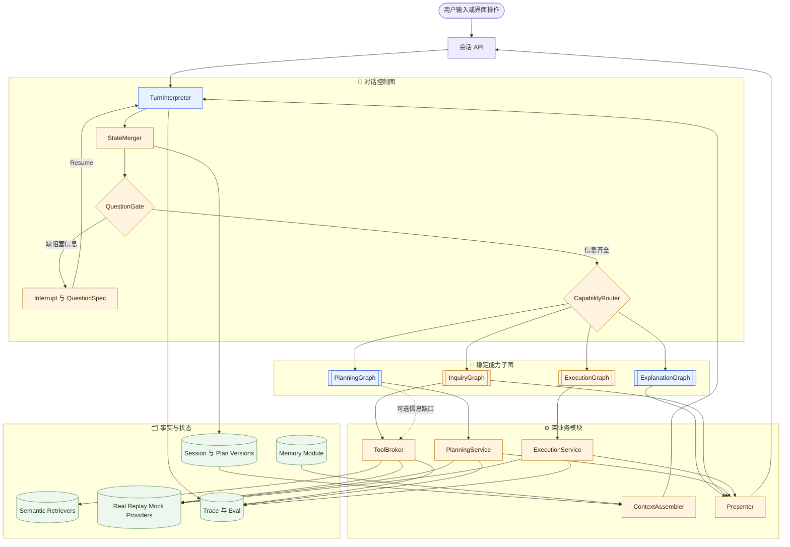
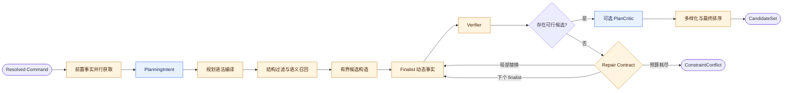
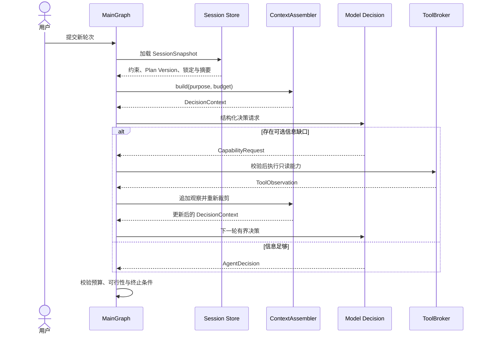

# HappyFreeTime V2 总体架构设计

> 状态：已确认的 V2 目标设计 | 更新日期：2026-09-04 | 适用范围：后续架构、接口、数据模型和实施决策 | 当前实现进展以根目录 `README.md` 和自动测试为准

---

## 1. 文档定位

本文档定义 HappyFreeTime V2 的目标架构。它用于统一后续开发，不是对当前代码的描述。

当本文档与早期的 [`mock_design.md`](../archive/v1/mock_design.md)、[`router_extractor_design_v2_draft.md`](../archive/router/router_extractor_design_v2_draft.md) 或实验代码冲突时，以本文档为准。早期文档保留为设计演进记录，不再作为实现契约。

项目目标不是制作只能跑固定故事的聊天 Demo，而是完成一个可修改、会记住家庭偏好、可执行、可恢复、可观测、可评测的本地生活规划产品闭环，并展示 AI Agent 应用开发中的工程判断。

## 2. 产品范围

### 2.1 产品承诺与竞争定位

HappyFreeTime 的产品承诺是：**记住同行人的稳定需求，基于可追溯事实生成可信方案，用户改变主意时只重排必要部分，并解释每次取舍和记忆影响。**

项目不以“更多 Agent 名称”或“让 LLM 自由排行程”为差异化，而以三个可验证能力形成主线：

1. **可信规划：** POI、天气、路线、营业和价格证据有来源、核验状态与降级语义；未知事实不能被 LLM 补写。
2. **克制修改：** 约束、锁定站点、Plan Version 和 `PlanDiff` 共同支持局部重规划；修改一处不无理由改变全部行程。
3. **可控记忆：** 记忆属于明确的人或同行范围，带证据、置信度、有效期和权限；用户可以查看、纠正、删除，并知道哪条记忆影响了方案。

对外产品表达是“可信、会记住一家人的周末管家”；“Stateful Agent / Graph Engineering”是技术实现与面试证据，不是用户价值本身。Graph 用于控制流和恢复，计划路线图用于可行性，家庭与记忆关系用于个性化；三者不能只因都可画成图就混为同一种实现。

### 2.2 首期范围

- 城市固定为北京，数据模型保留扩展到其他城市的能力。
- 支持短时、半日和一日规划，最多 4 个核心停靠点。
- 支持活动、餐厅、咖啡或甜品等通用停靠点组合。
- 生成 3 个满足硬约束且取舍不同的方案。
- 支持约束修改、局部替换、锁定停靠点和重新规划。
- 支持预览、确认、模拟订票、订座、取消与失败补偿。
- 接入真实天气、地理编码、路线时间和路线几何信息。
- 支持本人、家庭成员和临时同行范围的轻量长期记忆，并提供查看、纠正与删除。
- 提供完整前端、会话持久化、运行轨迹和基础评测。

### 2.3 数据真实性边界

| 数据类别 | 首期来源 | 要求 |
| --- | --- | --- |
| POI 名称、地址、坐标、类别 | 可重建 OSM 快照及后续审核数据 | 保存来源、许可、采集时间、最后验证时间和坐标系 |
| 天气、地理编码、路线 | 高德 Provider | 失败时允许缓存或本地估算降级 |
| 兴趣、亲子、场景适配等派生特征 | 版本化规则或受限模型推导 | 保存 derivation rule/model、输入事实、置信度；不能冒充来源事实 |
| 价格、库存、排队、套餐、可预约状态 | 确定性 Mock | UI 明确标识为模拟业务数据 |
| 订单与履约 | 本地模拟交易系统 | 有状态、幂等、可取消、可审计 |

Mock 不是“工具层”的同义词。Provider 负责外部事实，Mock 负责当前无法接入的业务环境，Tool 或 Service 只是统一能力入口。真实 API、回放数据和 Mock 实现必须遵循同一领域契约。

数据在领域内进一步区分为 `SourceFact`、`DerivedFeature` 和 `SimulatedState`。三类数据可以共同参与规划，但评分与 Presenter 必须保留其不同可信等级；模拟排队或人为概率不能包装成真实发生概率。POI 展示所需的图片、标签、营业摘要和详情组织在独立 `PoiPresentation` 中，规划内核仍只消费完成可行性判断所需的 `StopCandidate`，避免为了 UI 丰富度扩大规划接口。

### 2.4 暂不进入首期

- 全国多城市数据和大规模商家抓取。
- 真实支付、真实出票、真实网约车派单。
- 复杂注册、OAuth 和多角色权限系统。
- 为使用 MCP、微调、强化学习或 Beam Search 而提前增加复杂度。
- 让 LLM 自由调用有副作用工具。
- 为展示概念而把确定性 Planner、Verifier 或成员评分器包装成多个 LLM Agent。

## 3. 架构定位

V2 的目标形态是 **由状态图编排的受约束规划 Agent**：LLM 负责开放语言理解、信息需求和软语义决策，Harness 负责能力边界、事实获取、确定性计算、硬约束、副作用与最终终止。M2 已实现的是其中的确定性可信规划内核；对话控制层和受约束语义决策层按后续 Roadmap 渐进接入，不回退为全流程 ReAct。

选择该形态而不是纯确定性 Workflow、全流程 ReAct 或人为拆分的多 Agent，见 [`ADR-0001`](../adr/0001-constrained-hybrid-agent-graph.md)。

这不是传统的多个角色 Agent 串行对话，也不是允许模型无限思考和自由调用工具的单主循环。准确的工程表述是 **stateful graph-orchestrated hybrid planning agent**，而不是“多 Agent 系统”。Graph Engineering 不要求存在多个 Agent；它要求状态、分支、循环、中断、恢复、预算和副作用边界由可检查的图来编排。

只有同时满足下列条件，项目才从“带 LLM 的工作流”进入这里定义的 Agent 目标形态：

| 能力 | 模型的真实决策 | Harness 的不可让渡职责 |
| --- | --- | --- |
| 对话控制 | 解释操作、对象、引用、Patch 和自然语言偏好 | 校验命令、解析权限与会话归属、选择合法能力 |
| 信息获取 | 在可选语义信息不足时提出 `InformationNeed`，选择白名单只读能力 | 必需事实调度、工具参数校验、超时、缓存、预算和结果验证 |
| 方案语义 | 形成 `PlanningIntent`，影响语义查询、角色覆盖、站数范围、节奏和软排序 | 编译合法结构、构造候选、计算路线时间和预算、执行 Verifier |
| 迭代与停止 | 在观察结构化结果后提议继续检索、询问用户或 `FINISH` | 最大轮数、无进展检测、阻塞缺口、可行结果和副作用确认决定实际终止 |
| 解释与记忆 | 比较已验证方案、提出解释和 `MemoryCandidate` | 不允许创造事实；长期记忆的 scope、确认、冲突和删除规则由代码执行 |

因此，LLM 的输出必须能改变检索方向、候选结构或可行方案间的顺序，不能只负责开头抽取和末尾润色；同时任何模型决定都不能绕过确定性验证。若这些受约束决策尚未实现，对当前版本应诚实描述为“Graph 工作流 + 可信规划内核”，不能提前宣称完整 Agent 目标已经完成。

普通过滤、评分、数据访问和紧密的候选搜索仍然是函数或 Service。只有具备业务阶段、条件路由、模型观察后重试、人工确认、恢复或独立观测价值的步骤才进入 Graph。Provider 的一次普通调用不是 Graph 节点，避免把控制图膨胀成调用清单。

模块设计遵循“外部 Interface 小、内部 Implementation 深”：`PlanningService.plan(...)`、`MemoryService`、`ContextAssembler`、`ToolBroker` 和后续 `ExecutionService` 是稳定 Seam。外部调用者只学习领域输入、输出、不变量和错误模式；搜索算法、上下文裁剪、记忆冲突消解、衰减和补偿编排保持内部 Locality。真实外部依赖通过生产 Adapter 与测试/回放 Adapter 进入 Module；至少出现两个真实实现再固化抽象，避免假设性 Seam。

### 3.1 成立条件、局限与失败信号

该设计足以支持预期业务，但架构图本身不能证明 Agent 能力。是否成立取决于 M3/M3.5 的真实实现与消融证据：

| 风险或局限 | 失败信号 | 控制方式 |
| --- | --- | --- |
| 智能层只是换名 | LLM 输出不改变候选、结构或排序 | 记录影响链并做 rules-only 对照；无收益 Adapter 默认关闭 |
| 语义职责重复 | TurnInterpreter、PlanningIntent、StructureRanker、PlanCritic 都在重述同一偏好 | 一个语义入口；不建独立 LLM StructureRanker；Intent 管构造前、Critic 管 verified plan 后 |
| Graph 过度拆分 | 每个 Provider/过滤器都是节点，trace 很长但没有恢复或分支价值 | 使用节点准入规则；紧密计算保持在深 PlanningService 内 |
| 上下文越堆越长 | 每个调用都带全量历史、记忆和 POI | ContextAssembler 按 purpose 裁剪；结构化 SessionSnapshot 优先于聊天重推断 |
| Tool Loop 退化为 ReAct | 必需天气/路线也等待模型选择，调用轮数和延迟失控 | 必需事实代码调度；只读可选工具最多 2-3 轮；无进展终止 |
| RAG 为技术而技术 | 200 条数据上不优于标签基线，证据错误率上升 | 保留 RuleBasedRetriever；用 Recall@K/nDCG/方案偏好消融决定是否启用 |
| 模拟语料造成虚假质量 | 模型只记住模板或生成规则，换表达即退化 | 训练/评测 fixture 隔离、语言变体与人工标注小集；明确数据边界 |
| Agent 宣传超过事实 | 只有一次抽取和模板解释却声称自主 Agent/多 Agent | 当前与目标分开描述；只有完成模型观察循环和影响评测后升级表述 |

首期仍限定北京、1-4 个核心停靠点和受支持 Capability。开放自然语言不等于无限执行能力：不支持的 operation/subject 明确返回 `UNSUPPORTED`，不能让模型自由编造新工具或业务承诺。

## 4. 系统全景

>     accTitle: HappyFreeTime 受约束规划 Agent 总体架构
>     accDescr: 用户请求进入对话控制图，按能力路由到查询、规划、解释或执行子图；模型只在语义决策点工作，确定性服务负责事实、验证和副作用。



图中的 `ContextAssembler` 是被多个节点调用的 Module，不是单独决定路由的“上下文 Agent”。它回答“本次模型决策应该看见哪些有来源的信息”；MainGraph 回答“当前处于哪个阶段、下一步允许做什么”。数据投影与控制流职责不同，因此上下文加入后不会让上 层子图冗余。

### 4.1 分层职责

| 层 | 职责 | 不负责 |
| --- | --- | --- |
| API / UI | 会话、命令、SSE、展示、身份上下文 | 规划规则和订单副作用 |
| Orchestration | Graph 状态、Capability 路由、中断、恢复、循环预算 | 商家事实和评分细节 |
| Domain | Pydantic 契约、领域规则、状态机 | HTTP、数据库连接、LLM SDK |
| Decision | Turn 解释、PlanningIntent、可选语义工具选择与 PlanCritic | 硬约束裁决和直接副作用 |
| Services | 上下文装配、补全、召回、组合、评分、验证、执行策略 | 自由生成事实 |
| Memory | 记忆召回、候选提取、冲突消解、确认、影响证据和撤销 | 从一次行为直接制造长期硬约束 |
| Providers | 高德、天气、Mock 业务能力、缓存和回放 | 用户意图判断 |
| Persistence | 业务事实、会话、订单、轨迹和 checkpoint | 决策逻辑 |
| Observability / Eval | 事件、指标、回放、评测报告 | 修改业务结果 |

### 4.2 Module、Interface 与 Seam

| Module | 对外 Interface | 内部隐藏的复杂度 | 扩展方式 |
| --- | --- | --- | --- |
| `ContextAssembler` | `build(...) -> DecisionContext` | scope、裁剪、摘要、来源、token 与敏感字段策略 | 新 purpose 通过策略配置进入，不新增 Context Agent |
| `PlanningService` | `plan(PlanningRequest) -> CandidateSet` | 结构编译、召回、组合、评分、Verifier、Repair 与预算 | 保持调用 Interface；替换 grammar/组合器不会扩散到 API |
| `CandidateRetriever` | `retrieve(...) -> RetrievedCandidateSet` | 结构过滤、关键词/向量检索、rerank 与 evidence | `RuleBasedRetriever`、`HybridRagRetriever` 两个真实 Adapter |
| `ToolBroker` | `execute(...) -> ToolObservation` | registry、权限、预算、缓存、去重、脱敏与错误归一化 | Capability Adapter 可来自本地 Service 或 MCP |
| `MemoryService` | `recall / propose / decide` | scope、冲突、衰减、删除传播与影响证据 | SQLite/In-memory Adapter；向量召回是内部增强 |
| `ExecutionService` | preview、confirm、cancel | snapshot、幂等、订单状态机与 Saga | Booking/Mock Adapter 不能绕过确认 |

这些 Module 提供 Leverage 的前提是调用者不需要了解内部协作。`CapabilityRegistry` 是 ToolBroker 的策略数据，不单独包装成只有转发作用的空壳 Service；`QuestionComposer` 是 Gate 的可选 Implementation，不作为独立顶层 Agent。这样减少中间层数量并提高改动 Locality。

## 5. Graph 设计

### 5.1 MainGraph

MainGraph 负责产品级控制流，建议节点如下：

| 节点 | 类型 | 输入 | 输出 |
| --- | --- | --- | --- |
| `interpret_turn` | 最多 1 次必要 LLM | 最新用户输入、按用途裁剪的 `DecisionContext` | `ConversationCommand` |
| `resolve_state` | 确定性代码 | 命令、Session Snapshot | 已解析引用、合并后的 Patch 和锁定项 |
| `enrichment` | 确定性代码 + 必需 Provider | 原始约束、ActorContext | `NormalizedConstraints`、前置事实 |
| `question_gate` | 确定性代码 | Capability Contract、当前状态和阻塞缺口 | `QuestionSpec` 或继续 |
| `ask_question` | Graph interrupt | 一个最重要问题和结构化输入选项 | Resume 后的新输入或结构化值 |
| `capability_router` | 确定性代码 | 已校验 `ConversationCommand` | 一个允许的稳定子图 |
| `inquiry_subgraph` | 确定性主流程 + 可选只读 Tool Loop | 查询、搜索或比较请求 | 有来源的事实或比较结果 |
| `planning_subgraph` | 确定性内核 + 有界 LLM 决策 | 创建或修改命令、规范化约束 | `CandidateSet`、`PlanDiff` |
| `explanation_subgraph` | 模板 + 可选 1 次 LLM | 已验证方案、证据和取舍 | 不改变事实的解释 |
| `permission_gate` | 确定性代码 | 已选 Plan Version、执行预览 | 有效确认快照 |
| `execution_subgraph` | 确定性状态机 | 确认快照、ActorContext | `Order`、事件 |
| `persist_and_emit` | 基础设施 | 状态变化 | 数据库记录、`AgentEvent` |
| `feedback_and_memory` | 确定性主流程 + 可选 LLM 提取 | 完成/跳过/评分/纠正 | `MemoryCandidate[]`、确认或丢弃结果 |

`TurnInterpreter` 是当前 `RouterExtractor` 的演进和替代，不在 Router 后再叠加一次重复的全量语义解析。它识别组合式操作与参数；`CapabilityRouter` 只根据经过 schema 与权限校验的命令选择子图，不能听从自由文本跳过 Gate。界面按钮、约束面板和方案操作可直接产生结构化命令，绕过不必要的 LLM 解释。

### 5.2 子图与 Module 的边界

顶层只保留四类稳定子图：

- `InquiryGraph`：查询事实、搜索资源、比较候选。
- `PlanningGraph`：创建方案、定向修改、锁定与局部重规划。
- `ExplanationGraph`：解释已存在的方案、证据、差异和记忆影响。
- `ExecutionGraph`：预览、确认、执行、取消和补偿。

“晚饭换川菜”和“第二站换近一点”是同一 `PlanningGraph` 的不同 `ConstraintPatch`；“查天气”和“比较两家餐厅”是同一 `InquiryGraph` 的不同 `InformationNeed`。不为每句新表达新增 Intent 或 Graph 分支。

新增节点必须至少具备一项独立价值：可恢复状态、条件分支、模型观察后的有界循环、人工中断、副作用边界或需要单独评测。否则保留为深 Module 的内部 Implementation。尤其不把 `WeatherProvider`、`RouteProvider`、每一步过滤器或每个评分器拆成 Graph 节点。

### 5.3 PlanningSubgraph

>    accTitle: 受约束语义规划子图
>     accDescr: 规划先获取会影响召回的前置事实，再由模型形成语义意图；代码编译合法结构并构造候选，昂贵动态事实只验证 finalist，最终由 Verifier 和有界修复保证可行性。



前置事实和 finalist 事实必须分时获取，避免“方案生成以后才看天气”，也避免在全部组合上调用昂贵路线：

| 阶段 | 典型事实 | 用途与调度者 |
| --- | --- | --- |
| 进入规划前 | 当前时间、标准化地点、地理编码、日期 | Enrichment 确定性获取；形成可计算约束 |
| 召回前 | 对目标时段有影响的天气、已授权 MemoryContext | 代码并行获取；天气影响室内外剪枝，记忆影响软偏好 |
| 候选召回 | POI 结构化字段、语义资料和评论方面摘要 | `CandidateRetriever` 混合召回；模型可给查询与软分，代码做硬过滤 |
| finalist 验证 | 相邻路线、营业、Availability、返程 | 代码按预算获取；重建真实时间线并进入 Verifier |
| 执行前 | 最新价格、库存、取消政策 | ExecutionGraph 再次核验；旧确认快照失效时必须重确认 |

规划不是由模型临场编写自由文本日程。`PlanningIntent` 可以提出带证据的角色覆盖、先后偏好、站数范围、节奏、主题和语义查询；`StructureCompiler` 把这些约束编译为合法结构候选。模型不能直接创造任意骨架，也不决定 Constraint Strength。第一版不再增加单独的 LLM `StructureRanker`：抽象结构偏好由 `PlanningIntent` 一次表达、代码评分，避免两次模型调用重复判断。

`PlanCritic` 只在少量已通过 Verifier 的具体方案上评价语义匹配和体验连贯性。它与 `PlanningIntent` 的职责不同：前者评价完整可行方案，后者在构造前描述用户想要的结构和检索方向。若 deterministic 分数已明显区分候选或请求没有模糊体验语义，可以跳过 Critic。

M2 已用显式 `PlanSkeleton`、确定性搜索和模板 Presenter 建立可复现基线。后续把骨架内部演进为有限规划语法、接入 LLM Adapter 或替换组合算法时，继续保持 `PlanningService.plan(...) -> CandidateSet` 的外部 Interface；若修改场景需要更多输入，应引入版本化 `PlanningRequest`，而不是不断给方法增加位置参数。

### 5.4 ExecutionSubgraph

ExecutionSubgraph 管理有副作用的动作：预检、确认、执行、失败补偿和取消。业务订单是事实来源，Graph checkpoint 只负责恢复控制流。

## 6. 核心数据契约

Graph 顶层状态可以继续使用 `TypedDict`，但跨节点内容必须是 Pydantic 模型，不再传递语义不明确的自由 `dict`。

### 6.1 标识符

| 字段 | 含义 |
| --- | --- |
| `user_id` | 用户或匿名主体标识 |
| `session_id` | 会话标识，同时作为 LangGraph `thread_id` |
| `request_id` | 客户端为一次逻辑消息提交生成；同一次重试复用 |
| `planning_run_id` | 服务端一次逻辑提交处理生命周期的内部标识；`user_id + session_id + request_id` 唯一 |
| `plan_id` | 一个 Planning Run 产生的候选实例标识，不从方案内容派生 |
| `composition_fingerprint` | 骨架与有序资源组合的稳定指纹；用于候选去重，可跨会话重复 |
| `order_id` | 一次执行事务的业务主键 |

### 6.2 关键模型

| 模型 | 作用 | 关键内容 |
| --- | --- | --- |
| `ActorContext` | 身份与权限上下文 | identity type、user、session、locale、timezone |
| `ConversationCommand` | 一轮对话的组合式语义命令 | operation、subject、target、Patch、locks、requested facts、evidence、confidence |
| `Interpretation` | 当前实现的过渡契约 | primary intent、raw constraints、target、evidence；迁移后由 `ConversationCommand` 取代 |
| `TargetReference` | 指向已有领域对象 | plan version、stop、role、candidate、order 或 memory 的稳定引用/待解析表达 |
| `ConstraintPatch` | 对当前约束快照的显式增量 | set、remove、strength、source、target scope |
| `LockedStop` | 局部修改中不得无理由改变的停靠点 | plan version、stop identity、lock reason、owner |
| `PlanDiff` | 两个 Plan Version 的可解释差异 | stops、route、time、price、warnings、execution impact |
| `RawConstraints` | 保留用户原始表达 | date text、time text、location text、party、budget、avoid 等 |
| `TimeConstraintSet` | 不混淆的时间语义 | departure at、availability window、duration、return by |
| `NormalizedConstraints` | 规划的规范化约束输入 | 时间集合、坐标、预算、人数、距离、硬软约束 |
| `ConstraintValue[T]` | 单字段审计信息 | value、source、raw text、confidence、rule id |
| `Assumption` | 默认值说明 | 字段、默认值、原因、是否可修改 |
| `QuestionSpec` | Gate 输出给 Graph/UI 的反问契约 | field、question、input mode、options、severity、reason |
| `SessionSnapshot` | 本轮可引用的结构化会话状态 | current constraints、active Plan Version、locks、pending question、recent summary |
| `DecisionContext` | 面向一个模型决策的有界上下文投影 | purpose、facts、references、provenance、omissions、budget、allowed actions |
| `InformationNeed` | 继续决策前缺少的可获取信息 | kind、query、reason、required confidence、scope |
| `CapabilityRequest` | 模型对一个白名单只读能力的请求 | capability、validated arguments、need id |
| `ToolObservation` | ToolBroker 返回的结构化观察 | data、source、freshness、confidence、errors |
| `AgentDecision` | 模型对下一步的结构化提议 | continue、ask user、request capability、finish；由 Harness 校验 |
| `PlanningRequest` | PlanningService 的版本化输入包 | normalized constraints、PlanningIntent、前置事实、可用记忆影响、previous plan/locks、budgets |
| `PlanningIntent` | 规划语义输入 | required/optional roles、precedence、count range、pace、themes、evidence |
| `PlanSkeleton` | 不含具体 POI 的结构候选 | ordered/partial roles、required/optional、count range、eligibility、structure score |
| `Stop` | 通用停靠点 | resource、arrival、start、end、cost、evidence |
| `RouteLeg` | 停靠点间路线 | mode、distance、duration、geometry、source、degraded |
| `Plan` | 完整方案 | stops、route legs、score breakdown、tradeoffs、execution actions |
| `ConstraintConflict` | 无解结果 | 冲突字段、证据、可接受的放宽选项 |
| `ExecutionPlan` | 执行预览 | actions、price、risk、compensation policy、snapshot hash |
| `Order` / `OrderEvent` | 交易事实 | 状态、动作结果、错误、补偿和审计事件 |
| `PartyProfile` | 本次同行上下文 | 本人、家庭成员、临时同行人、关系和授权范围 |
| `MemoryItem` | 一条长期记忆事实 | subject、scope、kind、value、polarity、confidence、evidence、validity、sensitivity、status |
| `MemoryContext` | 本次允许注入的有界记忆 | selected memories、conflicts、omissions、retrieval version |
| `MemoryInfluence` | 记忆对结果的可解释影响 | memory id、plan/score/constraint target、direction、reason |
| `MemoryCandidate` | 尚未提交的记忆提议 | proposed item、source event、confirmation requirement、risk |
| `MemoryDecision` | 用户对记忆候选的处理结果 | accepted/rejected、resulting memory id、reason、decided at |
| `AgentEvent` | SSE 事件 | event id、run、stage、status、public payload、timestamp |

### 6.3 字段来源

所有影响规划的规范化字段必须标注来源：

- `user_explicit`：用户明确表达。
- `user_inferred`：从自然语言可靠推断，保留置信度和证据。
- `session_confirmed`：本会话中用户确认。
- `memory`：长期偏好。
- `system_context`：当前时间、时区、授权位置。
- `real_tool`：天气、地理编码、路线等 Provider 结果。
- `default_rule`：产品默认规则。

优先级为：当前用户明确约束 > 会话确认值 > 安全或业务硬规则 > 长期记忆 > 默认值。

## 7. 对话控制、上下文与补全

### 7.1 TurnInterpreter 与组合式命令

`TurnInterpreter` 是当前 `RouterExtractor` 的渐进演进，不是新增一个重复 Router。自然语言入口每轮默认最多进行 1 次必要 LLM 调用，使用 `with_structured_output(ConversationCommand)` 或等价结构化输出能力。

稳定的 `operation` 控制在：`CREATE`、`MODIFY`、`QUERY`、`SEARCH`、`COMPARE`、`EXPLAIN`、`EXECUTE`、`CHAT` 和 `UNSUPPORTED`。新表达优先表示为 `operation + subject + TargetReference + ConstraintPatch` 的组合，不为“换晚饭”“换第二站”“查新展”等句式增加新的 Graph Intent。

它负责：

- 识别操作、对象和用户明确要求的结果形式。
- 抽取所有相关原始约束，并保留证据与置信度。
- 把“这个方案”“第二站”“晚饭”表示为尚待解析或已带稳定 ID 的 `TargetReference`。
- 把“换近一点”“其他不变”表示为 Patch 和锁定意图。
- 提出用户明确请求查询的事实，但不自行制造 Provider 结果。

它不负责：

- 调用天气、定位、路线或写操作工具。
- 读取数据库并自行猜测“这个”指向哪个对象。
- 把“下午”“别太远”直接猜成最终数值或决定 Constraint Strength。
- 判断能否绕过确认、Verifier、权限与预算。

`StateMerger` 接收命令和 `SessionSnapshot`，用 Plan Version、选中方案、停靠点角色和当前 UI selection 解析引用，并按来源优先级生成新的约束快照。无法唯一解析的目标保持 unresolved，交给 Gate 反问；不允许让模型凭记忆中的名字直接修改未授权对象。

Prompt 可注入当前日期和时区帮助理解相对日期，但环境事实和默认值仍由 Enrichment 提供。结构化校验失败时重试 1 次；仍失败进入安全澄清。迁移期可由 Adapter 将旧 `Interpretation` 映射为 `ConversationCommand`，但最终只保留一个语义入口。

### 7.2 ContextAssembler：上下文是投影，不是控制流

后续修改、记忆和解释确实需要模型看到历史信息，但不能在每次调用中拼接完整对话、全部记忆、全部 POI 和所有旧方案。`ContextAssembler` 通过小 Interface 为一个明确用途生成 `DecisionContext`：

```text
build(purpose, command, session_snapshot, decision_budget) -> DecisionContext
```

`DecisionContext` 至少包含用途、最新用户轮次、必要的结构化状态、来源引用、被省略内容说明、允许动作和 token/工具预算。它是临时只读投影，不是事实来源；Session、Plan Version、MemoryItem 和 Provider Fact 仍保存在各自的事实存储中。

| 决策节点 | 必要上下文 | 默认不提供 |
| --- | --- | --- |
| TurnInterpreter | 最新用户输入、待回答问题、活跃方案/订单的短引用、近期摘要 | 全量 POI、全部 Provider 响应 |
| PlanningIntent | 规范化约束、相关 MemoryContext、前置天气、语义偏好证据 | 原始长对话、未授权记忆 |
| 可选 Tool Loop | 当前 InformationNeed、已获得观察、白名单能力、剩余预算 | 写工具、隐藏系统凭据 |
| PlanCritic | 少量已验证 finalist、PlanningIntent、语义证据和 tradeoff | 已淘汰方案、原始评论全集 |
| 修改解释 | 最新反馈、目标 Plan Version、LockedStop、PlanDiff | 无关会话和其他用户数据 |
| Presenter | 选中/候选方案、事实、warning、assumption、影响证据 | chain-of-thought 和未发生的工具调用 |



为控制上下文长度，短期保留最近少量原始轮次，较老对话生成可重建摘要；涉及约束、选择、锁定、计划和订单的内容必须进入结构化状态，不能只存在摘要文本中。记忆通过 `MemoryService.recall(...)` 形成有 scope 的 `MemoryContext` 后才可注入；“存在于记忆库”不等于“本轮模型有权看到”。每个上下文字段记录来源、版本和截断原因，以支持回放和泄露检查。

### 7.3 Enrichment Service 与时间模型

Enrichment 是确定性 Module，按顺序执行：

1. 合并本轮显式约束、已确认会话约束和允许使用的 `MemoryContext`。
2. 将相对日期、时间段和模糊距离映射为规则化值。
3. 获取当前时间、授权位置和地理编码；天气在确定日期、地点和时段后于规划召回前并行获取。
4. 根据能力与场景填入可默认字段。
5. 产出 `Assumption[]` 和字段来源，不静默覆盖用户值。

时间不再只有一个模糊 `time_window`。目标 `TimeConstraintSet` 区分：

- `departure_at`：明确出发时刻，例如“14:30 出发”。
- `available_from / available_until`：用户可用范围，Planner 可在其中选择出发时刻。
- `duration_minutes`：可玩时长，不等于结束时刻。
- `return_by`：包含返程的最晚到达出发地时刻。

“下午两点半出发”必须保留为精确 `departure_at=14:30`，不能被放宽成整个下午；“下午有空”才映射为可用时间窗。`departure_at + duration` 可以推导计划上界，显式 `return_by` 仍独立作为 Hard Constraint。多个时间锚点相互冲突时进入 Gate，不通过取最宽范围静默消解。迁移期间可把 `TimeConstraintSet` 编译为现有 `NormalizedConstraints.time_window`，但不能丢失原始语义与来源。

示例规则：

| 原始表达或缺失 | 默认或解析策略 |
| --- | --- |
| “下午” | 使用版本化规则映射为可用时间窗，例如 14:00-18:00 |
| “14:30 出发” | 生成精确 `departure_at`，分钟级进入时间线 |
| “别太远” | 使用版本化距离规则，例如北京城区 8km |
| 普通规划未给预算 | 使用可修改的人均默认预算 |
| 未说明同行人数 | 仅在不影响硬可行性时采用保守默认，并显式展示 |
| 未说明日期 | 按请求语义选择最近可用日期，否则 Gate 反问 |

规则必须有 `rule_id` 和版本号，便于回放与评测。

### 7.4 CapabilityRegistry、QuestionGate 与停止规则

`CapabilityRegistry` 是代码拥有的能力合同，声明支持的 `operation + subject`、必需字段、允许的只读工具、是否有副作用、确认级别和输出 schema。模型不能通过生成一个新能力名称扩展权限；`CapabilityRouter` 只路由已注册且通过 schema、权限与资源归属校验的命令。

`QuestionGate` 根据当前能力合同决定阻塞缺口，每轮最多问一个最重要问题。代码决定是否必须询问、合法输入范围和默认值边界；可选 LLM `QuestionComposer` 只优化文案和合法选项排序，失败时使用模板。

必须反问的典型情况：

- 执行时没有明确选中方案。
- 严格预算表达存在但缺少金额，且没有已确认预算。
- 预订动作缺少准确人数。
- 年龄限制资源需要儿童年龄，但该年龄未知。
- 修改或取消命令无法唯一确定目标。
- 时间或地点存在多个不可安全消解的解释。

通常不反问的情况：

- 普通规划缺少预算、距离或交通方式，可使用透明 Assumption。
- 只影响排序、不影响安全和可行性的软偏好。
- 天气、路线、当前时间等可通过已注册 Provider 获得的信息。

模型可以在受限循环中提议 `REQUEST_CAPABILITY`、`ASK_USER`、`CONTINUE` 或 `FINISH`。Harness 只有在输出 schema 有效、没有阻塞缺口、任务已有满足完成合同的结果且不存在待确认副作用时才接受 `FINISH`；达到最大轮数、调用/时间/token 预算、连续无进展或 Provider 熔断时由 Harness 强制停止并返回结构化降级或问题。系统总体策略仍是“能以透明假设继续就继续，只有不可逆、不可行或高歧义时才打断”。

## 8. 规划引擎

### 8.1 行程骨架

`Stop Role` 表示一站在行程中的语义作用，例如 `ACTIVITY`、`LUNCH`、`DINNER` 或 `BREAK`；它不等于资源类别，同一家餐厅可以承担午餐或晚餐。`PlanSkeleton` 只定义有序或部分有序的角色、必选/可选角色和站数范围，不预先锁定具体 POI，也不等于 `PlanStrategy`。

第一版使用少量版本化的显式骨架，示例包括：

| 站数 | 示例骨架 | 典型适用条件 |
| --- | --- | --- |
| 2 | `ACTIVITY -> MEAL`、`MEAL -> ACTIVITY` | 短时窗口或轻松节奏；具体餐次由时间与用户表达决定 |
| 3 | `LUNCH -> ACTIVITY -> DINNER` | 时间窗口覆盖午餐与晚餐，且两餐均有需求或合理偏好 |
| 3 | `ACTIVITY -> BREAK -> DINNER`、`ACTIVITY -> ACTIVITY -> MEAL` | 下午至晚间、休息偏好或丰富度偏好 |
| 4 | `ACTIVITY -> LUNCH -> ACTIVITY -> DINNER` | 一日窗口且最低停留、交通与缓冲均可容纳 |

时长区间只作为骨架资格和先验的一个信号，不再硬映射为唯一站数。骨架选择遵循：

1. 带“必须”“只去”“至少”“先……再……”等强约束语义或经用户确认的站数、角色、地点和先后关系转成 Hard Constraint；其余表达按证据与语义成为 Planning Preference，不能仅因来源是用户显式表达就自动设为 hard。
2. 用各角色最低停留时间、路线下界、必要缓冲和显式返程要求淘汰不可能骨架。
3. 对合法骨架按需求覆盖、时间锚点、节奏匹配、时间利用、缓冲风险和候选资源可得性计算结构分。
4. 保留少量不同站数或不同顺序的非支配骨架继续填充，避免在看到真实 POI 与路线前过早只选一个。
5. 未明确返程时不得把返程悄悄计入或排除“总距离/结束时间”；若用户表达 `return_by`，返程必须进入 Hard Constraint 和时间线。

骨架结构分只是先验，不直接保证最终 Plan 更优。具体 POI、真实路线和完整时间线生成后必须重新计算完整方案分数。不同站数不能简单累加单站分数，否则长行程会天然占优。

### 8.2 搜索和排序

第一版搜索流程：

1. 为每个骨架中的 Stop Role 召回 10-15 个资源，并按角色、时间和用户语义本地过滤到 5-8 个。
2. 对当前最多 4 站的小规模空间优先完整枚举，并用硬约束下界和支配关系提前剪枝。
3. 只保留 20-50 个高质量组合进入昂贵验证；路线返回后重建完整时间线并重新评分。
4. 从全部可行候选中做集合级多样化，输出最多 3 个，而不是机械返回数值分最高但内容近似的三个。

评分分四层，且 Hard Constraint 始终独立于评分：

| 层次 | 用途 | 主要信号 |
| --- | --- | --- |
| 单站角色分 | 召回后缩小候选池 | 角色适配、兴趣、价格证据、营业、天气、亲子与数据可信度 |
| 部分行程分 | 搜索剪枝或 Beam 保留 | 已有站点价值、出发地/相邻通勤估算、需求覆盖、剩余必选角色可完成性、剩余缓冲 |
| 完整方案分 | 真实路线和 Verifier 后最终排序 | 总交通、预算、时间利用、用餐对齐、主题连贯、风险、tradeoffs 与策略权重 |
| 候选集合分 | 选择最终三个方案 | POI/区域/骨架/策略重叠、成本与路程差异、用户可感知差异 |

部分行程分是便宜的启发估计，不能直接冒充完整方案分；完整方案必须基于 Provider 事实重新计算，并避免节点、边和全局指标重复计分。显式硬约束失败直接淘汰，不使用“足够大的负分”代替验证。

策略集合按场景动态选择：`balanced`、`low_cost`、`low_travel`、`experience`、`family_safe`、`weather_safe`。三个输出必须都满足硬约束，并在 POI 重叠、成本、距离、类别或策略上具有实际差异。

评分维度固定，权重按策略变化。每个维度保留分数、证据、奖励和惩罚原因，Presenter 只能总结这些已存在的事实。

首期不因算法名提前引入 Beam Search。若评测证明完整枚举出现组合或延迟瓶颈，内部组合器可按角色逐层扩展，每层只保留宽度 `K` 的部分行程。部分状态必须包含当前位置、当前时间、已覆盖角色、剩余必选角色、预算、缓冲和 `FINISH` 动作；不能以“时间未满就继续加站”作为停止规则。

目标形态把显式骨架推广为有限的角色状态机或规划语法：`PlanningIntent` 提供必选/可选角色、先后关系和站数范围，确定性代码将其编译为合法路径。该演进改变内部实现，不改变 `PlanningService.plan(...)` 外部接口。Beam Search 是组合规模扩大后的可替换实现，不是该目标形态成立的前提。

### 8.3 CandidateRetriever 与 RAG

模糊体验语义是当前标签匹配的真实业务缺口，因此 RAG 可以进入规划，但它的角色是 **Retrieval-Augmented Planning**，不是替代确定性 Planner。稳定 Seam 为：

```text
retrieve(planning_query, structured_filters, retrieval_budget) -> RetrievedCandidateSet
```

首版保留 `RuleBasedRetriever` Adapter 作为可复现基线，再增加 `HybridRagRetriever` Adapter。混合召回按以下顺序工作：

1. 代码先按地点范围、资源类型、显式饮食禁忌、年龄和其他可提前判定的 Hard Constraint 过滤。
2. `PlanningIntent` 生成一到数个有证据的语义查询，例如“适合父母、步行负担低但有新鲜感”。
3. 对 `PoiSemanticProfile`、版本化标签、描述、评论方面摘要和本地活动资料执行关键词 + 向量召回。
4. 可选 LLM reranker 只接收 Top-K 摘要和 evidence id，输出相关性、原因和引用；不能改写 POI 事实。
5. 结果映射回稳定 `resource_id`，进入既有角色池、组合评分、Provider 复核和 Verifier。

评论不在运行时整批塞入 Prompt。离线预处理为 `ReviewAspectSummary`，例如安静度、拥挤、步行负担、适合聊天、亲子和服务稳定性，并携带置信度、支持片段、来源类别与更新时间。当前简历项目可以使用明确标注的 Fixture 评论和稳定摘要来验证全链路；评测重点是相对标签基线的 Recall@K、nDCG、偏好命中和错误证据率，而不是伪装成实时大众点评数据。

结构化过滤、向量召回、LLM rerank 是可替换 Implementation；`CandidateRetriever` 的调用者不依赖向量库、embedding 模型或 MCP。RAG 不用于路线、天气、库存、营业和严格预算等结构化事实，也不能成为安全或 Hard Constraint 的唯一证据。

### 8.4 可行性验证

- 在组合阶段先用本地距离和时间估算剪枝。
- 只对 finalist 的相邻路线调用高德，避免建立昂贵的全量路线矩阵。
- 真实路线返回后重建时间线并执行完整校验。
- 违反硬约束时局部替换或重排，最多重规划 2 次。
- 仍无解时返回 `ConstraintConflict` 与可解释的放宽选项，禁止静默放宽硬约束。

双站阶段可以用“候选组合数”限制外部路线复核；扩展到 3/4 站后改用“Route Leg 调用预算”，因为同样 12 个候选在不同站数下产生的外部调用数量不同。预算耗尽必须产生可观测原因，不得进入无界搜索。

### 8.5 LLM 在规划中的职责

LLM 可以实质影响规划，但只通过结构化、有证据、可降级的接口：

- `PlanningIntent`：从模糊表达中提出角色覆盖、先后关系、站数范围、节奏和主题；确定性规则负责 Constraint Strength、合法骨架和可行性。
- 语义候选分：评价“有设计感”“适合聊天”“松弛”等难以规则化的偏好，可用于召回、部分行程启发或已验证候选的有界加分。
- `PlanCritic`：只对少量已通过 Verifier 的候选评价偏好匹配与体验连贯性，输出结构化分数、理由和证据引用；它可以改变可行候选之间的顺序，但不能复活违规候选。
- Presenter：根据 Plan、Score Breakdown、Source Facts、Warnings、Tradeoffs 和 Assumptions 解释为何选择该站数、顺序和地点，并比较方案差异。
- 后续有界修复：面对结构化 violation，只能从替换站点、选择其他骨架、改变软策略或向用户提问等允许动作中选择，随后必须重新验证且最多两轮。

LLM 不计算或裁决路线、时间、预算、营业、库存和 Hard Constraint，不发明 POI 或来源事实，不静默放宽约束，也不运行无界规划循环。所有可选 LLM 步骤必须有确定性回退，记录模型、Prompt、规则和输出版本，并通过离线评测证明相对规则基线的收益。

一个只要求“帮我安排一家晚饭”的命令应由 `PlanningIntent.minimum_stops=1` 与单角色规划语法自然表达，而不是被迫进入双站模板。对于没有模糊语义、只有一个明确目标的请求，允许直接使用确定性 Adapter，避免为了 Agent 形式增加无收益调用。

## 9. Provider、模型工具与 MCP

### 9.1 Provider 接口

- `GeocodingProvider`
- `WeatherProvider`
- `RouteProvider`
- `WebMapProvider`（只负责浏览器安全配置与固定上游代理；路线几何复用 `RouteProvider` 的 `RouteFact.geometry`）
- `CatalogProvider`
- `AvailabilityProvider`
- `BookingProvider`

高德实现可以共享底层客户端，但领域 Interface 保持分离。前端 Map Adapter 只渲染已复核的 `RouteLeg.geometry`，不再次执行路线搜索，避免同一 Plan 出现两份路线事实和重复外部调用。

Provider、模型 Tool 和 MCP 不是同一层：

- **Provider** 是获取外部或模拟事实的 Adapter，例如高德路线或 Replay 天气。
- **Tool** 是暴露给模型的、带参数 schema 和权限的能力；一个 Tool 可以组合多个 Provider、Retriever 与领域规则。
- **MCP** 是发现或调用 Tool 的协议 Adapter，不应成为内部领域模型或业务编排本身。

### 9.2 ToolBroker 与能力归属

模型只通过 `ToolBroker` 请求白名单能力：

```text
execute(capability_request, actor, decision_budget) -> ToolObservation
```

| 能力 | 决策归属 | 原因 |
| --- | --- | --- |
| 当前时间、时区、默认位置 | 代码直接获取 | 每轮都需要或不存在选择价值 |
| 地理编码、目标时段天气 | 代码按能力合同调度 | 是规划前置事实，跳过会损害正确性 |
| finalist 路线、营业、Availability、返程 | 代码按候选与预算调度 | 参数由候选决定，结果必须进入 Verifier |
| `search_poi_semantic` | 模型可选只读 Tool | 搜索方向取决于模糊体验语义 |
| `get_poi_evidence` | 模型可选只读 Tool | 只在候选差异需要更多证据时调用 |
| `retrieve_memory` | 模型提出 Need，代码执行 scope 过滤 | 相关性有语义价值，但权限不能交给模型 |
| `search_local_events` | 模型可选只读 Tool | 是否需要临展/活动信息取决于请求与召回质量 |
| `compare_candidate_experience` | 模型可选只读 Tool | 用于少量候选的软体验比较 |
| Verifier、持久化、幂等、确认与补偿 | 代码独占 | 属于不变量和副作用边界 |
| 下单、取消、记忆提交 | 模型只能提出意图 | 必须经过权限、确认、快照和业务状态机 |

ToolBroker 必须校验 capability 名称与参数、Actor scope、只读/写级别、超时、缓存、最大轮数、调用/时间/token 预算、结果 schema 和敏感字段脱敏。相同 `InformationNeed` 连续返回等价结果视为无进展，不能让模型反复调用。建议普通创建规划默认不启动 Tool Loop；仅当模糊语义、召回置信不足、比较或查询任务确有价值时启动，最多 2-3 轮。

这种设计保留 V2 相对 V1 的性能优势：必需天气、地址和路线不再经过“模型决定是否调用”的逐步循环；模型只在调用与否、调用什么确实会改变业务结果的 Seam 上获得决策权。

### 9.3 MCP 演进边界

内部 Module 先依赖稳定领域 Interface，而不是依赖 MCP SDK。以后可以增加两类 Adapter：

- `McpClientCapabilityAdapter`：把外部 MCP Server 的本地活动、票务或内容检索能力适配成内部 Capability。
- `McpServerAdapter`：把 HappyFreeTime 的只读 POI 搜索、方案解释或 Session 查询能力暴露给其他 Agent。

接入 MCP 不改变 `ConversationCommand`、`InformationNeed`、`ToolObservation`、`CandidateRetriever` 或 `PlanningService` 契约。写能力默认不通过 MCP 暴露；若未来确有需要，仍必须进入现有 Permission Gate、幂等和 ExecutionGraph，不能让协议层绕开 Harness。

### 9.4 运行模式

Provider 支持：

- `live`：调用真实 API。
- `record`：调用真实 API 并保存脱敏响应。
- `replay`：读取固定响应，用于测试和评测。
- `mock`：完全本地、确定性模拟。

### 9.5 降级顺序

```text
高德实时结果 -> 未过期或允许陈旧的缓存 -> Haversine + 规则速度本地估算
```

统一结果必须包含 `source`、`degraded_reason`、`verified_at`、`cache_age`。降级意味着仍返回可用但置信度较低的结果，不等于伪装成真实结果。

建议缓存：天气 30-60 分钟、路线 10-30 分钟并按时段分桶、地理编码长期缓存、失败结果 30-60 秒短缓存。

## 10. 执行与 Saga

所有执行动作由 `ExecutionPolicy` 从已选方案确定性生成。LLM 不获得写操作工具。

### 10.1 确认规则

- 所有写操作先生成执行预览。
- 默认一次汇总确认；高价格、不可逆或高风险动作需要二次确认。
- 确认对象包含资源、时间、数量、价格、取消政策和动作列表。
- 对确认快照计算 hash。价格、库存或动作变化后旧确认立即失效。
- 执行前再次检查库存和关键条件，预览不承诺锁定库存。

### 10.2 状态机

>     accTitle: 执行订单状态机
>     accDescr: 执行预览经用户确认后进入处理，成功成为已确认订单；失败、取消、退款失败和人工处理均有明确状态与恢复路径。


### 10.3 执行顺序与补偿

建议执行顺序：全量预检 -> 核心活动票 -> 餐厅 -> 定时 Mock 打车。

幂等键由 `session_id + plan_id + action_type + resource_id` 派生。若部分成功：

- 无损可逆时自动补偿。
- 取消会产生费用时暂停并向用户展示损失。
- 补偿失败时进入 `NEEDS_MANUAL_ATTENTION`。

已执行方案的修改不是直接覆盖，而是生成变更差异、损失预估和新的 Saga 确认。

## 11. 持久化、身份与记忆

### 11.1 存储

首期使用 SQLite：

- SQLAlchemy 2.x + Alembic 管理业务表。
- LangGraph SQLite checkpointer 使用同一数据库中的独立表。
- 业务事务先提交，再推进 checkpoint；幂等机制防止恢复时重复执行。
- `orders` 和 `order_events` 是交易事实来源，checkpoint 不能替代业务审计。

核心表：`users`、`sessions`、`messages`、`planning_runs`、`plans`、`orders`、`order_events`、`user_profiles`、`memories`、`trace_events`、`provider_cache`。Plan Version、约束快照、锁定项和对话摘要必须可从业务记录恢复；Graph checkpoint 不是这些产品概念的唯一存储。

除公共 Provider 缓存外，业务表从第一天包含 `user_id`。

### 11.2 身份演进

1. 开发初期使用固定 Demo 用户。
2. 前端完成后增加后端签发的匿名 HttpOnly、SameSite=Lax Cookie。
3. 公开部署前再考虑轻量注册登录和匿名身份合并。

`ActorContext.identity_type` 支持 `demo`、`anonymous`、`registered`。所有资源读取必须同时按资源 ID 与当前 `user_id` 过滤，不能只凭可猜测 ID 获取数据。

一个用户可拥有多个会话；同一会话同一时刻只允许一个活跃 run，不同会话可以并行。删除会话时清理消息、计划、checkpoint 和普通轨迹；订单审计按规则保留或匿名化。

一次消息提交先以 `(user_id, session_id, request_id)` 获取或创建 `Planning Run`。已完成的重复请求直接返回持久化响应；相同 Request ID 携带不同内容必须拒绝。成功时，助手消息、不可变 Plan Version 与完整响应快照在同一业务事务中提交。Checkpoint 只恢复 Graph 控制流，Session View 不直接暴露或依赖其内部结构。

### 11.3 记忆

记忆按生命周期分为三层：

- **Turn：** 当前输入、抽取结果和低置信度临时信号，只参与本轮。
- **Session：** 本次规划中确认的约束、同行人、选中方案、修改历史和实际完成情况。
- **Long-term：** 经明确保存、重复证据支持或再次确认的稳定偏好、约束、经历和承诺。

长期记忆不能只是一个反复重写的自由文本画像。`MemoryItem` 至少包含：

```text
memory_id
owner_user_id
subject_id                 # 本人、伴侣、孩子或家庭/临时同行组
scope                      # user | household | group
kind                       # preference | avoidance | constraint | fact | episode | promise
value / polarity
strength / confidence
source / evidence_ref
valid_from / expires_at / last_confirmed_at
sensitivity
status                     # proposed | active | disputed | deleted | expired
```

稳定的 `MemoryService` seam 对调用者只公开三类行为：

```text
recall(actor, planning_context) -> MemoryContext
propose(actor, feedback_or_events) -> MemoryCandidate[]
decide(actor, candidate_id, decision) -> MemoryDecision
```

召回过滤、相关性排序、置信度衰减、冲突检测、去重和摘要属于模块内部实现。SQLite Adapter 负责生产持久化，In-memory Adapter 负责接口测试；Planner 只消费有界 `MemoryContext`，不读取记忆表或向量库内部结构。

写入与使用规则：

1. 用户明确说“以后记住”可以直接形成高置信度候选；过敏、儿童安全等敏感硬约束仍需明确主体和确认。
2. 一次点击、一次未完成或一次地点选择只能形成低置信度候选，不能自动升级为长期硬约束。
3. 当前用户明确要求始终高于长期记忆；发生冲突时记录 `disputed` 或降低置信度，不静默覆盖当前输入。
4. “喜欢安静”一类记忆默认只影响软排序；只有明确、可审计的安全/业务约束才能作为 hard input。
5. 精确当前位置、原始对话和不必要的 PII 默认不进入长期记忆；用户可以逐条查看、纠正、冻结和删除。
6. 每次规划返回 `MemoryInfluence[]`，Presenter 可以解释“因为哪条记忆做了什么”，但不能用自由文案制造不存在的影响。

首版使用 SQLite 结构化查询即可；向量检索只在叙事型经历数量和评测证明有需要后作为内部 Adapter 增强，不能成为硬约束召回的唯一方式。

### 11.4 会话历史与模型上下文

会话历史、长期记忆和模型上下文是三个不同概念：

- `messages` 保存用户可见的完整对话历史，用于恢复与审计。
- `SessionSnapshot` 保存当前任务可引用的结构化状态，例如约束、活跃 Plan Version、锁定项、待确认动作和近期摘要。
- `DecisionContext` 是 `ContextAssembler` 针对一个模型节点生成的临时有界投影，用完即弃或只以脱敏 trace 记录。

修改请求至少向 TurnInterpreter 暴露最新输入、活跃方案的稳定引用、最近相关轮次和可用命令；向 PlanningIntent 暴露合并后的约束、相关 MemoryContext 和前置事实；向 PlanCritic 暴露已验证 finalist 与证据。不得依赖模型从长聊天记录中重新推断当前选中方案、锁定站点或订单状态。

摘要是压缩工具，不是事实存储。它必须关联源消息范围和摘要版本；摘要与结构化状态冲突时，以当前用户显式输入、已确认状态和业务事实为准。删除会话或记忆时，相应上下文投影和后续 trace 不得继续暴露已删除内容。

## 12. API 与前端

### 12.1 API 形态

FastAPI 是系统边界，建议首批端点：

```text
POST   /api/sessions
GET    /api/sessions
GET    /api/sessions/{session_id}
POST   /api/sessions/{session_id}/messages
PATCH  /api/sessions/{session_id}/constraints
POST   /api/sessions/{session_id}/plans/{plan_id}/select
POST   /api/sessions/{session_id}/feedback
GET    /api/memories
PATCH  /api/memories/{memory_id}
DELETE /api/memories/{memory_id}
POST   /api/sessions/{session_id}/execution/preview
POST   /api/sessions/{session_id}/execution/confirm
POST   /api/orders/{order_id}/cancel
GET    /api/sessions/{session_id}/events
```

所有普通响应使用 `ResponseEnvelope`，流式事件使用版本化 `AgentEvent`。外部 I/O 使用 async，规划核心保持同步纯函数，必要时放入 worker thread。

`POST .../messages` 要求客户端传入 `request_id`；`GET /api/sessions` 默认只返回少量最近非空会话，`GET .../{session_id}` 返回稳定的 Session View，包括完整消息和最近一次规划响应。前端以 URL 中的 `session` 定位当前会话，并用 History API 同步点击切换、刷新与前进/后退。

### 12.2 前端工作区

前端采用 React + Vite，首屏直接进入工作区，不制作营销落地页。

- 左栏：有界最近会话和新建会话；历史区限制高度，下部为本人/家庭记忆入口，不把全部记忆长期展开占满侧栏。
- 中栏：家庭管家式对话、渐进披露的约束摘要、方案对比和确认操作。默认只展示用户最关心的假设、风险和差异，完整来源与置信度进入详情抽屉。
- 右栏：行程、地图、订单 Tab；POI 详情使用抽屉或独立详情层，不把来源许可、调试字段和主要行动混在同一视觉层级。
- 底部抽屉：公开的运行阶段、Provider 来源与调试轨迹。

桌面端并排对比 3 个方案；移动端改为滑动方案和 Tab。方案卡先突出主题、总时长、总路程、预算、风险和关键取舍，再展开完整时间线。地图 marker、时间线和 Route Leg 双向联动；每个停靠点支持查看标签、营业摘要、评分证据、替换、锁定和打开地图导航。

规划等待态使用阶段化动效表达“理解需求、筛选地点、复核路线、比较方案”，不展示 chain-of-thought，也不伪造尚未执行的工具结果。Presenter 默认生成简短管家式说明，约束与证据采用渐进披露，避免把系统内部状态平铺成用户必须逐项阅读的表单。

按钮、约束面板和方案操作直接发送结构化 `ConversationCommand`，不经过 LLM；只有自然语言输入才进入 TurnInterpreter。SSE 只发布有用户价值的阶段事件，不暴露模型隐式推理过程。

前端支持无 LLM 演示模式：预置场景、结构化约束、规则规划、本地路线、Mock 执行和模板 Presenter 仍可完成闭环。

## 13. 可观测性与评测

### 13.1 运行轨迹

每个 run 至少记录：

- 脱敏输入、ConversationCommand、StateMerger 结果、Enrichment 结果和 Gate 决策。
- DecisionContext 的用途、版本、来源引用、裁剪原因和 token 估算；敏感正文默认只存 hash 或脱敏摘要。
- 候选数量、剪枝原因、评分策略、放宽建议。
- Provider 来源、缓存、降级原因、延迟。
- InformationNeed、CapabilityRequest、ToolObservation、停止原因和剩余预算。
- LLM 模型、调用次数、token、Prompt 版本、结构化输出与确定性 fallback。
- 执行动作、幂等键、订单事件和补偿结果。
- 代码版本、规则版本和评测数据集版本。

轨迹面板只展示经过整理的阶段信息和证据，不展示 chain-of-thought。

### 13.2 评测原则

- 自动测试随开发同步编写。
- M1 即建立 `EvalCase`、`RunTrace`、`EvalOutcome`，先放 5-8 个 smoke cases。
- 评测结果看约束满足和业务结果，不要求命中唯一 POI 名称。
- 真实 Provider 使用 record/replay 保持评测稳定。
- 主要指标是任务完成率和硬约束通过率，LLM Judge 只做辅助。
- V1 保留到完成一次 V1/V2 对比，然后移除旧链路。

最终可用于简历的候选指标包括：任务成功率、硬约束通过率、无效反问率、抽取 F1、`pass^3`、降级完成率、补偿成功率、P50/P95 延迟、平均 LLM 调用次数和 token 成本。

受约束智能层还需独立评测：

- `ConversationCommand` 的 operation/subject 准确率、TargetReference 解析率与 Patch fidelity。
- Tool 选择 precision/recall、无收益调用率、平均循环轮数、预算终止正确率和非法能力请求拦截率。
- `PlanningIntent` 的证据一致性、结构覆盖率，以及生成结构进入可行候选的比例。
- `CandidateRetriever` 的 Recall@K、nDCG、偏好命中和 evidence citation 正确率。
- `PlanCritic` 对人工成对偏好的 agreement，以及“不得改变 Verifier 结论”的 100% 不干扰率。

必须提供至少四组可回放消融：规则基线、规则 + Hybrid RAG、规则 + LLM PlanningIntent、完整受约束决策层。只有在语义质量相对基线有可复现提升，且 hard constraint pass、P95 延迟和成本仍达门槛时，相关 LLM Adapter 才默认开启。不能只展示几个正例来证明 Agent 能力。

记忆还需单独评测：同一请求在有/无记忆下的可解释差异、相关记忆命中率、错误记忆影响率、当前用户覆盖长期记忆成功率、跨用户隔离、过期/冲突处理和删除后不再生效。不能用预置“记忆等级”直接制造越来越准的曲线；任何提升都必须来自真实写入、召回和规划结果的可复现对照。

## 14. 配置、安全与部署

- 使用 `pydantic-settings` 管理模型、Provider、缓存、数据模式和功能开关。
- 高德 Web Service Key 只在后端；前端 JS Key 配置域名白名单和安全密钥。
- 日志和轨迹对精确位置、Cookie、API Key 和用户文本做脱敏。
- 关键写接口校验 ActorContext、资源归属、确认快照和幂等键。
- Docker 从架构早期保留，公开部署放在产品链路稳定之后。
- 服务端部署不是首期阻塞项；先确保本地一键运行、录制演示和回放评测可靠。

## 15. 目标目录

```text
app/
  api/                 # FastAPI routes, dependencies, SSE
  orchestration/       # MainGraph and subgraphs
  domain/              # Pydantic models, enums, domain errors
  services/            # context assembly, enrichment, planning, scoring, execution policy
  decision/            # TurnInterpreter, PlanningIntent, PlanCritic adapters
  capabilities/        # registry, ToolBroker and optional MCP adapters
  retrieval/           # rule and hybrid RAG CandidateRetriever implementations
  memory/              # recall/propose/decide module and influence evidence
  providers/           # amap, mock, replay, cache
  persistence/         # SQLAlchemy, repositories, migrations
  prompts/             # versioned interpreter, planning and presenter prompts
  observability/       # trace and metrics
frontend/              # React + Vite workspace
data/                  # curated POIs and replay fixtures
evals/                 # cases, runners, reports
tests/                 # unit, integration, contract, e2e
docs/                  # canonical design and runbooks
```

迁移期间允许 V1 与 V2 并存，但新代码只进入 `app/`，通过 `graph_version` 等 feature flag 切换。旧 Service 可用适配器复用，待 V2 完成一次基准对比后删除旧 Agent 链路和临时适配器。

## 16. 关键决策摘要

| 主题 | V2 决策 |
| --- | --- |
| Agent 形态 | 状态图编排的受约束规划 Agent；不采用自由工具主循环 |
| 产品定位 | 可信、可修改、会记住一家人的周末管家 |
| LLM 调用 | TurnInterpreter 最多 1 次必要调用；PlanningIntent、只读 Tool Loop、PlanCritic 和 Presenter 按门槛有界启用 |
| LLM 工具 | 只暴露有选择价值的白名单只读 Capability；必需事实由代码直接调度 |
| 多 Agent | 不为展示概念拆分；同一模型通过不同结构化角色 Adapter 工作，不宣称多 Agent |
| 规划 | LLM 影响语义意图、检索和可行候选软排序；代码负责编译、组合、事实、验证和 Repair |
| Graph | MainGraph + Inquiry/Planning/Explanation/Execution 稳定子图；普通 Provider 调用不节点化 |
| 上下文 | ContextAssembler 按节点构造有 provenance 和预算的 DecisionContext；不整包拼接历史 |
| 数据契约 | Pydantic 跨节点契约，拒绝自由 dict 漂移 |
| 真实能力 | 高德天气、地理编码、路线；业务动态数据 Mock |
| 执行 | 预览、快照确认、幂等、订单状态机、Saga 补偿 |
| 持久化 | SQLite + SQLAlchemy/Alembic + SQLite checkpointer |
| 身份 | Demo user 起步，匿名 Cookie 和轻登录后置 |
| 记忆 | 结构化、分主体/范围、证据化、可确认与撤销；Planner 只消费有界 MemoryContext |
| 前端 | 管家式对话 + 渐进披露约束 + POI/路线详情 + 地图时间线联动 |
| 评测 | 从 M1 建基础，结果导向，record/replay，可回归 |
| RAG | 作为 CandidateRetriever/MemoryRetriever Adapter 解决模糊体验与叙事记忆召回，不替代结构化事实 |
| MCP | 后期作为 Capability 的 Client/Server Adapter；不侵入领域契约、不绕过 Harness |
