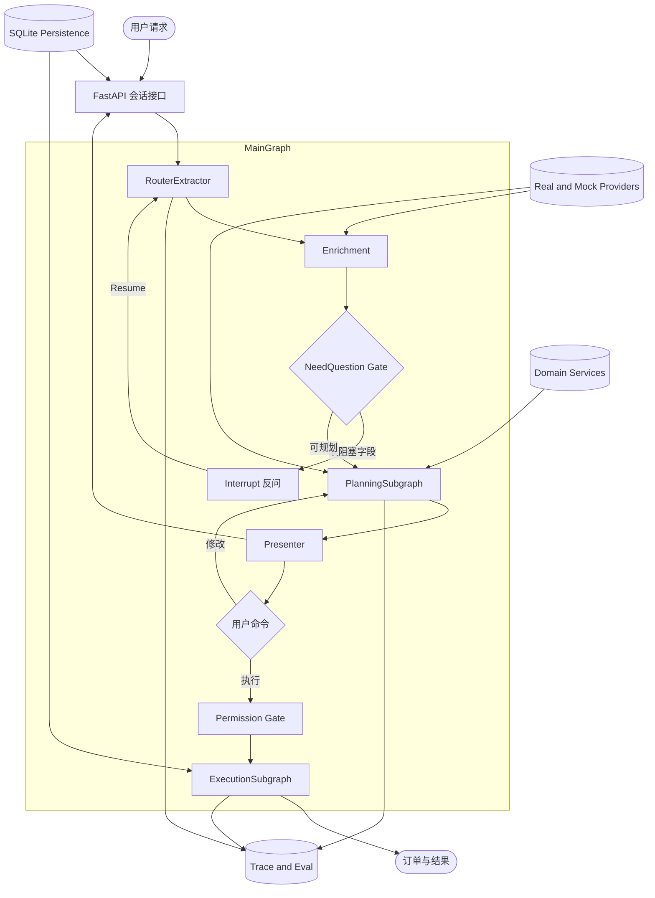
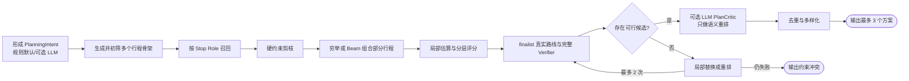
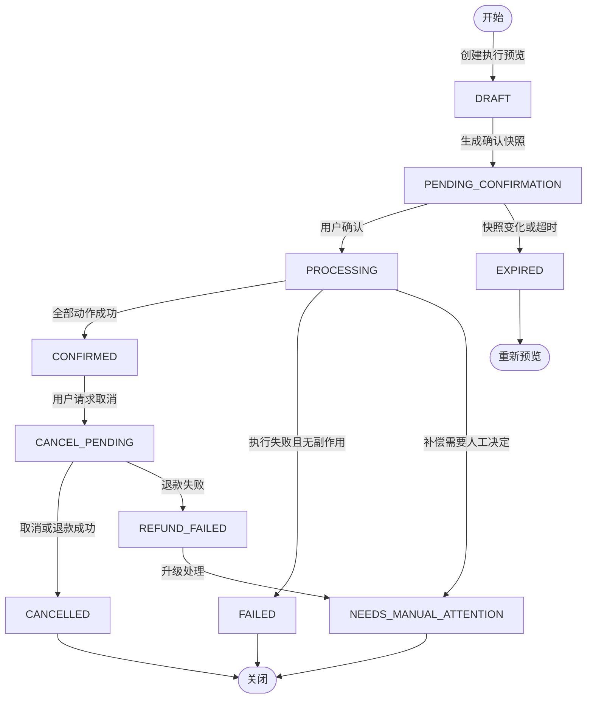

# HappyFreeTime V2 总体架构设计

> 状态：已确认的 V2 设计基线 | 更新日期：2026-08-24 | 适用范围：后续架构、接口、数据模型和实施决策 | 当前实现进展以根目录 `README.md` 和自动测试为准

---

## 1. 文档定位

本文档定义 HappyFreeTime V2 的目标架构。它用于统一后续开发，不是对当前代码的描述。

当本文档与早期的 [`mock_design.md`](../archive/v1/mock_design.md)、[`router_extractor_design_v2_draft.md`](../archive/router/router_extractor_design_v2_draft.md) 或实验代码冲突时，以本文档为准。早期文档保留为设计演进记录，不再作为实现契约。

项目目标不是制作只能跑固定故事的聊天 Demo，而是完成一个可修改、可执行、可恢复、可观测、可评测的本地生活规划产品闭环，并展示 AI Agent 应用开发中的工程判断。

## 2. 产品范围

### 2.1 首期范围

- 城市固定为北京，数据模型保留扩展到其他城市的能力。
- 支持短时、半日和一日规划，最多 4 个核心停靠点。
- 支持活动、餐厅、咖啡或甜品等通用停靠点组合。
- 生成 3 个满足硬约束且取舍不同的方案。
- 支持约束修改、局部替换、锁定停靠点和重新规划。
- 支持预览、确认、模拟订票、订座、取消与失败补偿。
- 接入真实天气、地理编码、路线时间和路线几何信息。
- 提供完整前端、会话持久化、运行轨迹和基础评测。

### 2.2 数据真实性边界

| 数据类别 | 首期来源 | 要求 |
| --- | --- | --- |
| POI 名称、地址、坐标、类别 | 人工整理的真实北京 POI | 保存来源、采集时间、最后验证时间 |
| 天气、地理编码、路线 | 高德 Provider | 失败时允许缓存或本地估算降级 |
| 价格、库存、排队、套餐、可预约状态 | 确定性 Mock | UI 明确标识为模拟业务数据 |
| 订单与履约 | 本地模拟交易系统 | 有状态、幂等、可取消、可审计 |

Mock 不是“工具层”的同义词。Provider 负责外部事实，Mock 负责当前无法接入的业务环境，Tool 或 Service 只是统一能力入口。真实 API、回放数据和 Mock 实现必须遵循同一领域契约。

### 2.3 暂不进入首期

- 全国多城市数据和大规模商家抓取。
- 真实支付、真实出票、真实网约车派单。
- 复杂注册、OAuth 和多角色权限系统。
- 为使用 MCP、微调、强化学习或 Beam Search 而提前增加复杂度。
- 让 LLM 自由调用有副作用工具。

## 3. 架构定位

V2 定位为 **基于 LangGraph 的有状态垂直 Agent Harness**，采用“LLM 语义理解 + 确定性业务引擎 + 显式状态机”的混合架构。

它不是传统的多个角色 Agent 串行对话，也不是一个允许模型无限思考和自由调用工具的单主循环。Graph 的价值体现在：

- 管理多轮状态、`interrupt/resume` 和会话恢复。
- 表达规划、修改、执行、取消等条件分支。
- 为真实 Provider 降级、局部重规划和 Saga 补偿提供可恢复边界。
- 让关键业务阶段能够独立追踪、测试和评测。

普通解析、过滤、评分和数据访问仍然是函数或 Service。只有具备业务阶段、条件路由、重试降级、人工确认或独立观测价值的步骤才进入 Graph。

## 4. 系统全景



### 4.1 分层职责

| 层 | 职责 | 不负责 |
| --- | --- | --- |
| API / UI | 会话、命令、SSE、展示、身份上下文 | 规划规则和订单副作用 |
| Orchestration | Graph 状态、路由、中断、恢复、降级 | 商家事实和评分细节 |
| Domain | Pydantic 契约、领域规则、状态机 | HTTP、数据库连接、LLM SDK |
| Services | 补全、召回、组合、评分、验证、执行策略 | 自由生成事实 |
| Providers | 高德、天气、Mock 业务能力、缓存和回放 | 用户意图判断 |
| Persistence | 业务事实、会话、订单、轨迹和 checkpoint | 决策逻辑 |
| Observability / Eval | 事件、指标、回放、评测报告 | 修改业务结果 |

## 5. Graph 设计

### 5.1 MainGraph

MainGraph 负责产品级控制流，建议节点如下：

| 节点 | 类型 | 输入 | 输出 |
| --- | --- | --- | --- |
| `router_extractor` | 1 次 LLM | 用户输入、必要会话摘要 | `Interpretation` |
| `enrichment` | 确定性代码 + Provider | 原始约束、ActorContext | `NormalizedConstraints` |
| `need_question_gate` | 确定性代码 | 约束、意图、当前资源 | `QuestionDecision` |
| `ask_question` | Graph interrupt | 单个最重要问题 | resume 后的新输入 |
| `planning_subgraph` | 确定性主流程 + 可选有界 LLM 启发 | 规范化约束 | `CandidateSet`、`Plan[]` |
| `presenter` | 模板，允许 1 次可选 LLM | 已验证方案与证据 | 展示模型 |
| `permission_gate` | 确定性代码 | 已选方案、执行预览 | 确认快照 |
| `execution_subgraph` | 确定性状态机 | 确认快照、ActorContext | `Order`、事件 |
| `persist_and_emit` | 基础设施 | 状态变化 | 数据库记录、`AgentEvent` |

路由由代码决定。LLM 可以识别 `plan`、`refine`、`select`、`execute`、`cancel`、`chitchat` 等命令，但不能决定是否绕过确认或直接执行写操作。

### 5.2 PlanningSubgraph



规划不是由 Planner Agent 临场编写自由文本日程。LLM 可以形成带证据的 `PlanningIntent`，提出角色覆盖、先后关系、站数范围和节奏偏好，也可以在已验证候选之间评价语义匹配与体验连贯性；确定性引擎仍负责枚举、路线、时间、预算、营业、硬约束和最终可行性。LLM 的建议是启发和有界评分信号，不是事实来源，也不能让不可行方案通过。

M2 第一版默认跳过可选 LLM `PlanCritic`，先用显式 `PlanSkeleton`、确定性搜索和模板 Presenter 建立可复现基线。后续增加 LLM 启发或替换内部搜索算法时，保持 `PlanningService.plan(NormalizedConstraints) -> CandidateSet` 的外部接口不变。

### 5.3 ExecutionSubgraph

ExecutionSubgraph 管理有副作用的动作：预检、确认、执行、失败补偿和取消。业务订单是事实来源，Graph checkpoint 只负责恢复控制流。

## 6. 核心数据契约

Graph 顶层状态可以继续使用 `TypedDict`，但跨节点内容必须是 Pydantic 模型，不再传递语义不明确的自由 `dict`。

### 6.1 标识符

| 字段 | 含义 |
| --- | --- |
| `user_id` | 用户或匿名主体标识 |
| `session_id` | 会话标识，同时作为 LangGraph `thread_id` |
| `request_id` | 客户端为一次逻辑消息提交生成；同一次重试复用 |
| `planning_run_id` | 服务端一次逻辑提交处理生命周期的内部标识；`user_id + session_id + request_id` 唯一 |
| `plan_id` | 一个 Planning Run 产生的候选实例标识，不从方案内容派生 |
| `composition_fingerprint` | 骨架与有序资源组合的稳定指纹；用于候选去重，可跨会话重复 |
| `order_id` | 一次执行事务的业务主键 |

### 6.2 关键模型

| 模型 | 作用 | 关键内容 |
| --- | --- | --- |
| `ActorContext` | 身份与权限上下文 | identity type、user、session、locale、timezone |
| `Interpretation` | Router 输出 | primary intent、commands、raw constraints、evidence、confidence |
| `RawConstraints` | 保留用户原始表达 | date text、time text、location text、party、budget、avoid 等 |
| `NormalizedConstraints` | 规划唯一输入 | 绝对时间、坐标、预算、人数、距离、硬软约束 |
| `ConstraintValue[T]` | 单字段审计信息 | value、source、raw text、confidence、rule id |
| `Assumption` | 默认值说明 | 字段、默认值、原因、是否可修改 |
| `QuestionDecision` | Gate 输出 | need question、field、question、severity |
| `PlanningIntent` | 规划语义输入 | required/optional roles、precedence、count range、pace、themes、evidence |
| `PlanSkeleton` | 不含具体 POI 的结构候选 | ordered/partial roles、required/optional、count range、eligibility、structure score |
| `Stop` | 通用停靠点 | resource、arrival、start、end、cost、evidence |
| `RouteLeg` | 停靠点间路线 | mode、distance、duration、geometry、source、degraded |
| `Plan` | 完整方案 | stops、route legs、score breakdown、tradeoffs、execution actions |
| `ConstraintConflict` | 无解结果 | 冲突字段、证据、可接受的放宽选项 |
| `ExecutionPlan` | 执行预览 | actions、price、risk、compensation policy、snapshot hash |
| `Order` / `OrderEvent` | 交易事实 | 状态、动作结果、错误、补偿和审计事件 |
| `AgentEvent` | SSE 事件 | event id、run、stage、status、public payload、timestamp |

### 6.3 字段来源

所有影响规划的规范化字段必须标注来源：

- `user_explicit`：用户明确表达。
- `user_inferred`：从自然语言可靠推断，保留置信度和证据。
- `session_confirmed`：本会话中用户确认。
- `memory`：长期偏好。
- `system_context`：当前时间、时区、授权位置。
- `real_tool`：天气、地理编码、路线等 Provider 结果。
- `default_rule`：产品默认规则。

优先级为：当前用户明确约束 > 会话确认值 > 安全或业务硬规则 > 长期记忆 > 默认值。

## 7. RouterExtractor、Enrichment 与 Gate

### 7.1 RouterExtractor

RouterExtractor 每轮最多进行 1 次必要 LLM 调用，使用 `with_structured_output(Interpretation)` 或等价结构化输出能力。

它负责：

- 识别用户意图和直接命令。
- 抽取所有与规划相关的原始表达。
- 为抽取字段附证据片段和置信度。
- 识别修改目标、选择目标和取消目标。

它不负责：

- 调用天气、定位或路线工具。
- 把“下午”“别太远”直接猜成最终数值。
- 填默认预算、人数和距离。
- 判断是否允许执行订单。

Prompt 可注入当前日期和时区，帮助理解相对日期语言，但不得把默认位置、天气或业务默认值混入用户约束。结构化校验失败时重试 1 次，并附带验证错误；仍失败则进入安全澄清，不得伪装成闲聊成功。

### 7.2 Enrichment Service

Enrichment 是确定性服务，按顺序执行：

1. 合并本轮显式约束、已确认会话约束和允许使用的记忆。
2. 将相对日期、时间段和模糊距离映射为规则化值。
3. 获取当前时间、授权位置、地理编码和天气。
4. 根据场景填入可默认字段。
5. 产出 `Assumption[]` 和字段来源，不静默覆盖用户值。

示例规则：

| 原始表达或缺失 | 默认或解析策略 |
| --- | --- |
| “下午” | 使用版本化规则映射为时间窗，例如 14:00-18:00 |
| “别太远” | 使用版本化距离规则，例如北京城区 8km |
| 普通规划未给预算 | 使用可修改的人均默认预算 |
| 未说明同行人数 | 仅在不影响硬可行性时采用保守默认，并显式展示 |
| 未说明日期 | 按请求语义选择最近可用日期，否则 Gate 反问 |

规则必须有 `rule_id` 和版本号，便于回放与评测。

### 7.3 NeedQuestion Gate

Gate 只问会阻止当前动作继续的问题，每轮最多问一个最重要的问题。

必须反问的典型情况：

- 执行时没有明确选中方案。
- 严格预算表达存在但缺少金额，且没有已确认预算。
- 预订动作缺少准确人数。
- 年龄限制资源需要儿童年龄，但该年龄未知。
- 修改或取消命令无法确定目标。
- 时间或地点存在多个不可安全消解的解释。

通常不反问的情况：

- 普通规划缺少预算、距离或交通方式，可使用透明默认值。
- 只影响排序、不影响安全和可行性的软偏好。
- 天气、路线、当前时间等可以通过 Provider 获得的信息。

系统总体策略是“能以透明假设先规划，就先给用户可修改的结果；只有不可逆、不可行或歧义较高时才打断”。

## 8. 规划引擎

### 8.1 行程骨架

`Stop Role` 表示一站在行程中的语义作用，例如 `ACTIVITY`、`LUNCH`、`DINNER` 或 `BREAK`；它不等于资源类别，同一家餐厅可以承担午餐或晚餐。`PlanSkeleton` 只定义有序或部分有序的角色、必选/可选角色和站数范围，不预先锁定具体 POI，也不等于 `PlanStrategy`。

第一版使用少量版本化的显式骨架，示例包括：

| 站数 | 示例骨架 | 典型适用条件 |
| --- | --- | --- |
| 2 | `ACTIVITY -> MEAL`、`MEAL -> ACTIVITY` | 短时窗口或轻松节奏；具体餐次由时间与用户表达决定 |
| 3 | `LUNCH -> ACTIVITY -> DINNER` | 时间窗口覆盖午餐与晚餐，且两餐均有需求或合理偏好 |
| 3 | `ACTIVITY -> BREAK -> DINNER`、`ACTIVITY -> ACTIVITY -> MEAL` | 下午至晚间、休息偏好或丰富度偏好 |
| 4 | `ACTIVITY -> LUNCH -> ACTIVITY -> DINNER` | 一日窗口且最低停留、交通与缓冲均可容纳 |

时长区间只作为骨架资格和先验的一个信号，不再硬映射为唯一站数。骨架选择遵循：

1. 带“必须”“只去”“至少”“先……再……”等强约束语义或经用户确认的站数、角色、地点和先后关系转成 Hard Constraint；其余表达按证据与语义成为 Planning Preference，不能仅因来源是用户显式表达就自动设为 hard。
2. 用各角色最低停留时间、路线下界、必要缓冲和显式返程要求淘汰不可能骨架。
3. 对合法骨架按需求覆盖、时间锚点、节奏匹配、时间利用、缓冲风险和候选资源可得性计算结构分。
4. 保留少量不同站数或不同顺序的非支配骨架继续填充，避免在看到真实 POI 与路线前过早只选一个。
5. 未明确返程时不得把返程悄悄计入或排除“总距离/结束时间”；若用户表达 `return_by`，返程必须进入 Hard Constraint 和时间线。

骨架结构分只是先验，不直接保证最终 Plan 更优。具体 POI、真实路线和完整时间线生成后必须重新计算完整方案分数。不同站数不能简单累加单站分数，否则长行程会天然占优。

### 8.2 搜索和排序

第一版搜索流程：

1. 为每个骨架中的 Stop Role 召回 10-15 个资源，并按角色、时间和用户语义本地过滤到 5-8 个。
2. 对当前最多 4 站的小规模空间优先完整枚举，并用硬约束下界和支配关系提前剪枝。
3. 只保留 20-50 个高质量组合进入昂贵验证；路线返回后重建完整时间线并重新评分。
4. 从全部可行候选中做集合级多样化，输出最多 3 个，而不是机械返回数值分最高但内容近似的三个。

评分分四层，且 Hard Constraint 始终独立于评分：

| 层次 | 用途 | 主要信号 |
| --- | --- | --- |
| 单站角色分 | 召回后缩小候选池 | 角色适配、兴趣、价格证据、营业、天气、亲子与数据可信度 |
| 部分行程分 | 搜索剪枝或 Beam 保留 | 已有站点价值、出发地/相邻通勤估算、需求覆盖、剩余必选角色可完成性、剩余缓冲 |
| 完整方案分 | 真实路线和 Verifier 后最终排序 | 总交通、预算、时间利用、用餐对齐、主题连贯、风险、tradeoffs 与策略权重 |
| 候选集合分 | 选择最终三个方案 | POI/区域/骨架/策略重叠、成本与路程差异、用户可感知差异 |

部分行程分是便宜的启发估计，不能直接冒充完整方案分；完整方案必须基于 Provider 事实重新计算，并避免节点、边和全局指标重复计分。显式硬约束失败直接淘汰，不使用“足够大的负分”代替验证。

策略集合按场景动态选择：`balanced`、`low_cost`、`low_travel`、`experience`、`family_safe`、`weather_safe`。三个输出必须都满足硬约束，并在 POI 重叠、成本、距离、类别或策略上具有实际差异。

评分维度固定，权重按策略变化。每个维度保留分数、证据、奖励和惩罚原因，Presenter 只能总结这些已存在的事实。

首期不因算法名提前引入 Beam Search。若评测证明完整枚举出现组合或延迟瓶颈，内部组合器可按角色逐层扩展，每层只保留宽度 `K` 的部分行程。部分状态必须包含当前位置、当前时间、已覆盖角色、剩余必选角色、预算、缓冲和 `FINISH` 动作；不能以“时间未满就继续加站”作为停止规则。

目标形态把显式骨架推广为有限的角色状态机或规划语法：`PlanningIntent` 提供必选/可选角色、先后关系和站数范围，确定性代码将其编译为合法路径。该演进改变内部实现，不改变 `PlanningService.plan(...)` 外部接口。Beam Search 是组合规模扩大后的可替换实现，不是该目标形态成立的前提。

### 8.3 可行性验证

- 在组合阶段先用本地距离和时间估算剪枝。
- 只对 finalist 的相邻路线调用高德，避免建立昂贵的全量路线矩阵。
- 真实路线返回后重建时间线并执行完整校验。
- 违反硬约束时局部替换或重排，最多重规划 2 次。
- 仍无解时返回 `ConstraintConflict` 与可解释的放宽选项，禁止静默放宽硬约束。

双站阶段可以用“候选组合数”限制外部路线复核；扩展到 3/4 站后改用“Route Leg 调用预算”，因为同样 12 个候选在不同站数下产生的外部调用数量不同。预算耗尽必须产生可观测原因，不得进入无界搜索。

### 8.4 LLM 在规划中的职责

LLM 可以实质影响规划，但只通过结构化、有证据、可降级的接口：

- `PlanningIntent`：从模糊表达中提出角色覆盖、先后关系、站数范围、节奏和主题；确定性规则负责 Constraint Strength、合法骨架和可行性。
- 语义候选分：评价“有设计感”“适合聊天”“松弛”等难以规则化的偏好，可用于召回、部分行程启发或已验证候选的有界加分。
- `PlanCritic`：只对少量已通过 Verifier 的候选评价偏好匹配与体验连贯性，输出结构化分数、理由和证据引用；它可以改变可行候选之间的顺序，但不能复活违规候选。
- Presenter：根据 Plan、Score Breakdown、Source Facts、Warnings、Tradeoffs 和 Assumptions 解释为何选择该站数、顺序和地点，并比较方案差异。
- 后续有界修复：面对结构化 violation，只能从替换站点、选择其他骨架、改变软策略或向用户提问等允许动作中选择，随后必须重新验证且最多两轮。

LLM 不计算或裁决路线、时间、预算、营业、库存和 Hard Constraint，不发明 POI 或来源事实，不静默放宽约束，也不运行无界规划循环。所有可选 LLM 步骤必须有确定性回退，记录模型、Prompt、规则和输出版本，并通过离线评测证明相对规则基线的收益。

## 9. Provider 与降级

### 9.1 Provider 接口

- `GeocodingProvider`
- `WeatherProvider`
- `RouteProvider`
- `WebMapProvider`（只负责浏览器安全配置与固定上游代理；路线几何复用 `RouteProvider` 的 `RouteFact.geometry`）
- `CatalogProvider`
- `AvailabilityProvider`
- `BookingProvider`

高德实现可以共享底层客户端，但领域接口保持分离。前端 Map Adapter 只渲染已复核的 `RouteLeg.geometry`，不再次执行路线搜索，避免同一 Plan 出现两份路线事实和重复外部调用。首期直接在后端使用 Provider，不通过 MCP 增加额外协议层；后期可在稳定 Service 上增加轻量、只读 MCP 适配器。

### 9.2 运行模式

Provider 支持：

- `live`：调用真实 API。
- `record`：调用真实 API 并保存脱敏响应。
- `replay`：读取固定响应，用于测试和评测。
- `mock`：完全本地、确定性模拟。

### 9.3 降级顺序

```text
高德实时结果 -> 未过期或允许陈旧的缓存 -> Haversine + 规则速度本地估算
```

统一结果必须包含 `source`、`degraded_reason`、`verified_at`、`cache_age`。降级意味着仍返回可用但置信度较低的结果，不等于伪装成真实结果。

建议缓存：天气 30-60 分钟、路线 10-30 分钟并按时段分桶、地理编码长期缓存、失败结果 30-60 秒短缓存。

## 10. 执行与 Saga

所有执行动作由 `ExecutionPolicy` 从已选方案确定性生成。LLM 不获得写操作工具。

### 10.1 确认规则

- 所有写操作先生成执行预览。
- 默认一次汇总确认；高价格、不可逆或高风险动作需要二次确认。
- 确认对象包含资源、时间、数量、价格、取消政策和动作列表。
- 对确认快照计算 hash。价格、库存或动作变化后旧确认立即失效。
- 执行前再次检查库存和关键条件，预览不承诺锁定库存。

### 10.2 状态机



### 10.3 执行顺序与补偿

建议执行顺序：全量预检 -> 核心活动票 -> 餐厅 -> 定时 Mock 打车。

幂等键由 `session_id + plan_id + action_type + resource_id` 派生。若部分成功：

- 无损可逆时自动补偿。
- 取消会产生费用时暂停并向用户展示损失。
- 补偿失败时进入 `NEEDS_MANUAL_ATTENTION`。

已执行方案的修改不是直接覆盖，而是生成变更差异、损失预估和新的 Saga 确认。

## 11. 持久化、身份与记忆

### 11.1 存储

首期使用 SQLite：

- SQLAlchemy 2.x + Alembic 管理业务表。
- LangGraph SQLite checkpointer 使用同一数据库中的独立表。
- 业务事务先提交，再推进 checkpoint；幂等机制防止恢复时重复执行。
- `orders` 和 `order_events` 是交易事实来源，checkpoint 不能替代业务审计。

核心表：`users`、`sessions`、`messages`、`planning_runs`、`plans`、`orders`、`order_events`、`user_profiles`、`memories`、`trace_events`、`provider_cache`。

除公共 Provider 缓存外，业务表从第一天包含 `user_id`。

### 11.2 身份演进

1. 开发初期使用固定 Demo 用户。
2. 前端完成后增加后端签发的匿名 HttpOnly、SameSite=Lax Cookie。
3. 公开部署前再考虑轻量注册登录和匿名身份合并。

`ActorContext.identity_type` 支持 `demo`、`anonymous`、`registered`。所有资源读取必须同时按资源 ID 与当前 `user_id` 过滤，不能只凭可猜测 ID 获取数据。

一个用户可拥有多个会话；同一会话同一时刻只允许一个活跃 run，不同会话可以并行。删除会话时清理消息、计划、checkpoint 和普通轨迹；订单审计按规则保留或匿名化。

一次消息提交先以 `(user_id, session_id, request_id)` 获取或创建 `Planning Run`。已完成的重复请求直接返回持久化响应；相同 Request ID 携带不同内容必须拒绝。成功时，助手消息、不可变 Plan Version 与完整响应快照在同一业务事务中提交。Checkpoint 只恢复 Graph 控制流，Session View 不直接暴露或依赖其内部结构。

### 11.3 记忆

记忆分为三层：

- Turn：当前输入和抽取结果。
- Session：本次规划中确认的约束、选中方案和修改历史。
- User：明确要求长期保存、重复出现或再次确认的稳定偏好。

长期记忆只保存常用位置、预算区间、同行结构、饮食限制、交通偏好和明确喜恶，并提供查看与删除能力。精确当前位置默认只在当前会话使用。

## 12. API 与前端

### 12.1 API 形态

FastAPI 是系统边界，建议首批端点：

```text
POST   /api/sessions
GET    /api/sessions
GET    /api/sessions/{session_id}
POST   /api/sessions/{session_id}/messages
PATCH  /api/sessions/{session_id}/constraints
POST   /api/sessions/{session_id}/plans/{plan_id}/select
POST   /api/sessions/{session_id}/execution/preview
POST   /api/sessions/{session_id}/execution/confirm
POST   /api/orders/{order_id}/cancel
GET    /api/sessions/{session_id}/events
```

所有普通响应使用 `ResponseEnvelope`，流式事件使用版本化 `AgentEvent`。外部 I/O 使用 async，规划核心保持同步纯函数，必要时放入 worker thread。

`POST .../messages` 要求客户端传入 `request_id`；`GET /api/sessions` 默认只返回少量最近非空会话，`GET .../{session_id}` 返回稳定的 Session View，包括完整消息和最近一次规划响应。前端以 URL 中的 `session` 定位当前会话，并用 History API 同步点击切换、刷新与前进/后退。

### 12.2 前端工作区

前端采用 React + Vite，首屏直接进入工作区，不制作营销落地页。

- 左栏：有界最近会话和新建会话；历史区限制高度，下部保留给记忆管理。
- 中栏：对话、约束面板、方案对比、确认操作。
- 右栏：行程、地图、订单 Tab。
- 底部抽屉：公开的运行阶段、Provider 来源与调试轨迹。

桌面端并排对比 3 个方案；移动端改为滑动方案和 Tab。地图 marker 与时间线双向联动，每个停靠点支持替换、锁定和查看依据。

按钮、约束面板和方案操作直接发送结构化命令，不经过 LLM；只有自然语言输入才进入 RouterExtractor。SSE 只发布有用户价值的阶段事件，不暴露模型隐式推理过程。

前端支持无 LLM 演示模式：预置场景、结构化约束、规则规划、本地路线、Mock 执行和模板 Presenter 仍可完成闭环。

## 13. 可观测性与评测

### 13.1 运行轨迹

每个 run 至少记录：

- 脱敏输入、Router 输出、Enrichment 结果和 Gate 决策。
- 候选数量、剪枝原因、评分策略、放宽建议。
- Provider 来源、缓存、降级原因、延迟。
- LLM 模型、调用次数、token、Prompt 版本。
- 执行动作、幂等键、订单事件和补偿结果。
- 代码版本、规则版本和评测数据集版本。

轨迹面板只展示经过整理的阶段信息和证据，不展示 chain-of-thought。

### 13.2 评测原则

- 自动测试随开发同步编写。
- M1 即建立 `EvalCase`、`RunTrace`、`EvalOutcome`，先放 5-8 个 smoke cases。
- 评测结果看约束满足和业务结果，不要求命中唯一 POI 名称。
- 真实 Provider 使用 record/replay 保持评测稳定。
- 主要指标是任务完成率和硬约束通过率，LLM Judge 只做辅助。
- V1 保留到完成一次 V1/V2 对比，然后移除旧链路。

最终可用于简历的候选指标包括：任务成功率、硬约束通过率、无效反问率、抽取 F1、`pass^3`、降级完成率、补偿成功率、P50/P95 延迟、平均 LLM 调用次数和 token 成本。

## 14. 配置、安全与部署

- 使用 `pydantic-settings` 管理模型、Provider、缓存、数据模式和功能开关。
- 高德 Web Service Key 只在后端；前端 JS Key 配置域名白名单和安全密钥。
- 日志和轨迹对精确位置、Cookie、API Key 和用户文本做脱敏。
- 关键写接口校验 ActorContext、资源归属、确认快照和幂等键。
- Docker 从架构早期保留，公开部署放在产品链路稳定之后。
- 服务端部署不是首期阻塞项；先确保本地一键运行、录制演示和回放评测可靠。

## 15. 目标目录

```text
app/
  api/                 # FastAPI routes, dependencies, SSE
  orchestration/       # MainGraph and subgraphs
  domain/              # Pydantic models, enums, domain errors
  services/            # enrichment, planning, scoring, execution policy
  providers/           # amap, mock, replay, cache
  persistence/         # SQLAlchemy, repositories, migrations
  prompts/             # versioned Router and Presenter prompts
  observability/       # trace and metrics
frontend/              # React + Vite workspace
data/                  # curated POIs and replay fixtures
evals/                 # cases, runners, reports
tests/                 # unit, integration, contract, e2e
docs/                  # canonical design and runbooks
```

迁移期间允许 V1 与 V2 并存，但新代码只进入 `app/`，通过 `graph_version` 等 feature flag 切换。旧 Service 可用适配器复用，待 V2 完成一次基准对比后删除旧 Agent 链路和临时适配器。

## 16. 关键决策摘要

| 主题 | V2 决策 |
| --- | --- |
| Agent 形态 | 有状态垂直 Agent Harness，不采用自由工具主循环 |
| LLM 数量 | Router 必需 1 次，Presenter 可选 1 次 |
| LLM 工具 | 首期不向 LLM 暴露工具 |
| 规划 | 确定性召回、组合、评分、验证和局部重规划 |
| Graph | MainGraph + PlanningSubgraph + ExecutionSubgraph |
| 数据契约 | Pydantic 跨节点契约，拒绝自由 dict 漂移 |
| 真实能力 | 高德天气、地理编码、路线；业务动态数据 Mock |
| 执行 | 预览、快照确认、幂等、订单状态机、Saga 补偿 |
| 持久化 | SQLite + SQLAlchemy/Alembic + SQLite checkpointer |
| 身份 | Demo user 起步，匿名 Cookie 和轻登录后置 |
| 评测 | 从 M1 建基础，结果导向，record/replay，可回归 |
| MCP | 后期在稳定 Service 上增加轻量只读适配器 |
