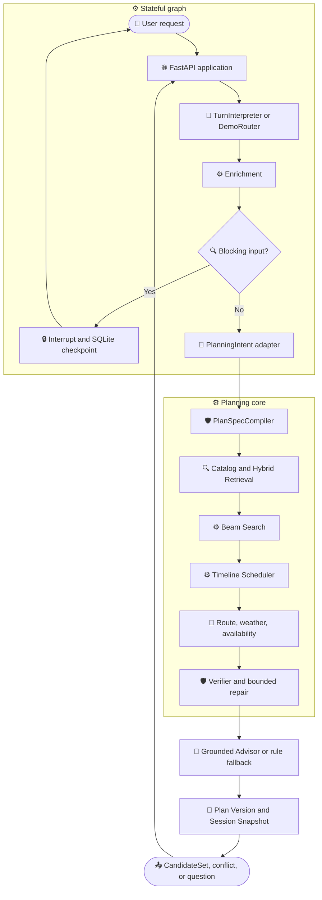

# Resume V2 当前架构

_Resume V2 发布基线的实现快照；更新时间：2026-09-26。本文只描述已落地代码，不描述长期目标。_

---

## 📋 文档定位

这是一份“当前系统是什么”的架构说明，依据：

- 发布 tag：planner-v2-eval-baseline，指向 bef5fa3；
- 评测代码提交：db8603b，是发布 tag 的祖先；
- 36 条人工复核 Frozen Fixture；
- 当前代码、自动测试和 Resume V2 发布报告。

如果本文与根 README、代码或自动测试冲突，以代码和测试为准。目标架构、长期记忆、真实执行、Saga 和 MCP 演进见 canonical/architecture_v2.md，不能从目标设计推断为当前能力。

## 🎯 当前系统解决什么问题

系统面向北京本地生活和周末出行规划，输入可以是：

- 日期、出发地、出发/返程时间；
- 同行人、预算、距离和饮食要求；
- 活动、餐食、节奏、场景和开放偏好；
- 选中方案后的定向修改。

系统输出最多三个已经通过事实和硬约束复核的候选方案，或者输出结构化反问/冲突。当前使用版本化 POI Catalog、可复现 Demo World，以及 mock/replay/live Provider Adapter；Demo World 的商业信息是模拟数据，不是实时商户承诺。

## 🔗 运行时总链路

Graph 只编排有状态分支、反问恢复和有限决策；普通过滤、评分、Provider 调用和搜索保持在 Service/Adapter 内部，不为每个函数增加 Graph 节点。

## 🧠 语义入口与状态边界

### TurnInterpreter

真实 Router 输出受限的 Wire Proposal，主要包括：

- 用户操作：创建、修改、查询或聊天；
- 原始约束和用户证据；
- 受限的修改目标引用；
- PlanningIntent 所需的语义入口。

模型不能输出真实资源 ID、应用已经知道的方案 ID、路线价格营业库存等外部事实，也不能生成可以绕过权限和状态校验的执行命令。

Wire Proposal 由 Harness 编译为内部领域对象。旧 Interpretation 字段仍保留部分兼容能力，但不应理解为模型直接拥有整个领域状态。

### Enrichment 与 QuestionGate

Enrichment 将已识别的用户表达补成可计算约束，并保留来源、假设和 warning。它可以使用安全默认值，但不能用系统默认值覆盖用户明确输入。

QuestionGate 根据当前状态和能力合同判断是否必须反问。反问是确定性策略，问题文案和选项可以由模板生成；Graph 通过 interrupt/resume 暂停，回答只更新当前待补字段，不把整段历史重新交给 Router。

### Constraint Patch

已有方案后的补充约束进入共享 ConstraintPatchCompiler：

1. 解析日期、时间、返程、预算、距离、地点和偏好补丁；
2. 一次性验证并合并；
3. 如果信息不足，返回待补字段；
4. 如果冲突，返回结构化冲突；
5. 通过后以当前 Plan Version 为基线重新规划，并生成新版本。

定向替换仍走 REPLACE 边界：例如“保留餐厅，只把活动换近一点”不会被当成普通约束补丁。

## 🧩 结构提案与规划搜索

### PlanningIntent 与 PlanSpecCompiler

PlanningIntent 可以提出软目标、角色顺序、required/optional slots、站数范围、节奏和角色级语义查询。

它不是最终 Planner，也不能直接决定事实和硬约束。PlanSpecCompiler 负责校验角色顺序、餐时关系、站数和重复角色；将 optional slot 展开为有限结构变体；生成稳定结构标识；在结构不可编译或后段无法验证时回退到规则结构。

当前设计不是“模型从注册表中挑一个骨架”，也不是“模型直接生成最终路线”，而是“模型提出受限结构，Harness 将其编译成可搜索结构并裁决可执行性”。

### Beam Search

Beam 是当前默认搜索路径，主要价值是资源控制：

- 为不同结构保留公平搜索机会；
- 限制组合扩展量；
- 用语义、时间、营业和路线估算做软排序；
- 保留 finalist 进入真实 Route、Availability 和 Verifier；
- 不把本地估算误当作最终硬事实。

Legacy Search 仍保留为显式模式和受控回退，便于兼容旧 checkpoint、调试和版本对照。当前评测证明 Beam 在相同安全结果下显著减少扩展量，但尚未证明它在小型 Demo World 上必然提高方案质量。

### 时间与路线

- 精确出发、返程截止和显式时间窗是用户约束；
- 午餐/晚餐使用角色级餐时锚点；
- 本地路线估算用于排序和预算控制；
- finalist 才调用 Route Provider 重建真实或 replay 时间线；
- 最终由 Verifier 检查路线、时间窗、营业、预算、距离、返程和 Availability。

## 🔌 Provider、数据和降级

| Provider | 作用 | 可用模式 |
| --- | --- | --- |
| Catalog | POI 召回和静态硬过滤 | snapshot、fixture、demo |
| Weather | 日期/地点天气事实 | mock、replay、record、live |
| Route | 站间距离、时长和 geometry | mock、replay、record、live、本地估算 |
| Geocoding | 用户地点归一化 | mock、replay、live、降级 |
| Availability | finalist 的动态可用性检查 | mock、replay、降级 |

统一事实包含来源、核验时间和降级原因。未知或陈旧事实不会被伪装成已确认事实。

## 💾 持久化与恢复

- Session：连续对话和用户归属；
- Planning Run：一次逻辑请求及其幂等边界；
- Plan Version：不可变候选方案版本；
- PlanDiff：修改前后的结构化差异；
- SQLite checkpoint：Graph 控制流暂停和恢复；
- Provider replay/cache：评测和离线复现所需的规范化事实。

Checkpoint 不是订单事实，也不是长期记忆。当前没有真实订单、预订、叫车或长期用户记忆模块。

## 📊 当前评测证据

详见 Resume V2 发布评测：

- Frozen C0–C4 使用同一份 36 条 reviewed Interpretation，隔离 Rule/LLM PlanningIntent、Rule/Hybrid Retrieval 和 Advisor；
- C3/C4 任务完成率为 36/36，硬约束安全率为 100%，9/9 修改链路通过；
- Live B0/B3 用于观察真实 Router 稳定性，不能与 Frozen 结果混为生产成功率；
- Hybrid Retrieval 的 Recall@5 为 0.537，Rule baseline 为 0.240；
- Advisor 接受的结果通过 Plan/Evidence/Fact ID grounding，失败时安全回退；
- BGE 冷启动延迟与稳态延迟分开记录。

## 🚫 当前明确未实现

以下内容在目标架构或路线图中出现，但不属于 Resume V2 当前能力：

- 真实下单、预订、叫车和 Saga 补偿；
- 可确认、可删除的长期记忆；
- MCP Client/Server Adapter 接入主链；
- 任意城市和任意交通方式；
- 任意自然语言自动生成无限骨架；
- 生产级实时 POI、库存和价格；
- 完整 Temporal AST 和通用 Constraint AST。

这些内容应进入路线图或 backlog，不应写进当前系统介绍。

## 📍 代码入口

| 层 | 入口 |
| --- | --- |
| Graph/API | app/orchestration/entry_graph.py、app/api/application.py |
| 领域契约 | app/domain/ |
| 语义入口 | app/services/router_extractor.py、app/services/demo_router.py |
| 约束与反问 | app/services/enrichment.py、app/services/question_gate.py、app/services/constraint_patch.py |
| 规划与结构 | app/services/planning.py、app/services/planning_intent.py、app/services/plan_spec_compiler.py |
| Provider | app/providers/ |
| 持久化 | app/persistence/ |
| 评测 | evals/ |

## 🎓 学习建议

先读根 README 和发布报告建立当前系统概念；再读本文；随后按一次请求流向阅读 TurnInterpreter → Enrichment → QuestionGate → PlanningIntent → PlanSpecCompiler → PlanningService → Provider/Verifier → Persistence。每读完一层，运行对应测试，再回到发布报告核对证据。
