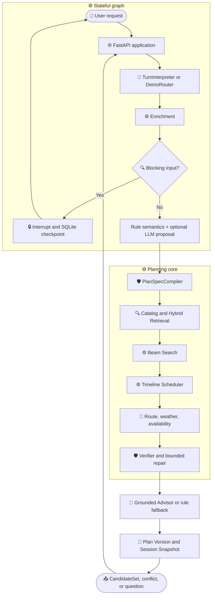

# Resume V2 当前架构

_Resume V2 当前实现快照；核对日期：2026-10-02。发布 tag 仍是冻结评测基线，S-CORE1 后续收敛以本分支代码和新报告为准。本文只描述已落地代码，不描述长期目标。_

---

## 📋 文档定位

这是一份“当前系统是什么”的架构说明，依据：

- 发布 tag：planner-v2-eval-baseline，指向 bef5fa3；
- 评测代码提交：db8603b，是发布 tag 的祖先；
- 36 条人工复核 Frozen Fixture；
- S-CORE1A/B/C 的代码、自动测试和阶段报告；其评测代码提交 `52fd353` 的正式结果见 [S-CORE1C 报告](../status/s_core1c_release_20261002.md)。该分支未合并 `main`；冻结 tag 的历史指标仍只对应旧提交。

如果本文与根 README、代码或自动测试冲突，以代码和测试为准。目标架构、长期记忆、真实执行、Saga 和 MCP 演进见 canonical/architecture_v2.md，不能从目标设计推断为当前能力。

## 🎯 当前系统解决什么问题

系统面向北京本地生活和周末出行规划，输入可以是：

- 日期、出发地、出发/返程时间；
- 同行人、预算、距离和饮食要求；
- 活动、餐食、节奏、场景和开放偏好；
- 选中方案后的定向修改。

系统输出最多三个已经通过事实和硬约束复核的候选方案，或者输出结构化反问/冲突。当前使用版本化 POI Catalog、可复现 Demo World，以及 mock/replay/live Provider Adapter；Demo World 的商业信息是模拟数据，不是实时商户承诺。

## 🔗 运行时总链路

```mermaid
flowchart TB
    accTitle: Resume V2 Runtime Architecture
    accDescr: The current implementation separates natural language interpretation, deterministic planning, external fact verification, grounded presentation, and durable session state.

    input([👤 User request]) --> api[🌐 FastAPI application]

    subgraph graph_control["⚙️ Stateful graph"]
        api --> turn[🧠 TurnInterpreter or DemoRouter]
        turn --> enrich[⚙️ Enrichment]
        enrich --> gate{🔍 Blocking input?}
        gate -->|Yes| pause[🔒 Interrupt and SQLite checkpoint]
        pause --> input
        gate -->|No| intent[🧠 PlanningIntent adapter]
    end

    subgraph planning_core["⚙️ Planning core"]
        intent[Rule semantics + optional LLM proposal] --> spec[🛡️ PlanSpecCompiler]
        spec --> retrieve[🔍 Catalog and Hybrid Retrieval]
        retrieve --> search[⚙️ Beam Search]
        search --> schedule[⚙️ Timeline Scheduler]
        schedule --> facts[🔌 Route, weather, availability]
        facts --> verify[🛡️ Verifier and bounded repair]
    end

    verify --> advice[🧠 Grounded Advisor or rule fallback]
    advice --> state[💾 Plan Version and Session Snapshot]
    state --> output([📤 CandidateSet, conflict, or question])
    output --> api
```

Graph 只编排有状态分支、反问恢复和有限决策；普通过滤、评分、Provider 调用和搜索保持在 Service/Adapter 内部，不为每个函数增加 Graph 节点。

## 🧠 语义入口与状态边界

### TurnInterpreter

真实 Router 输出受限的 Wire Proposal，主要包括：

- 用户操作：创建、修改、查询或聊天；
- 原始约束和用户证据；
- 受限的修改目标引用；
- PlanningIntent 所需的语义入口。

模型不能输出真实资源 ID、应用已经知道的方案 ID、路线价格营业库存等外部事实，也不能生成可以绕过权限和状态校验的执行命令。

Wire Proposal 由 Harness 编译为内部领域对象。旧 Interpretation 字段仍保留部分兼容能力，但不应理解为模型直接拥有整个领域状态。

### Enrichment 与 QuestionGate

Enrichment 将已识别的用户表达补成可计算约束，并保留来源、假设和 warning。它可以使用安全默认值，但不能用系统默认值覆盖用户明确输入。

QuestionGate 根据当前状态和能力合同判断是否必须反问。反问是确定性策略，问题文案和选项可以由模板生成；Graph 通过 interrupt/resume 暂停，回答只更新当前待补字段，不把整段历史重新交给 Router。

### Constraint Patch

已有方案后的补充约束进入共享 ConstraintPatchCompiler：

1. 解析日期、时间、返程、预算、距离、地点和偏好补丁；
2. 一次性验证并合并；
3. 如果信息不足，返回待补字段；
4. 如果冲突，返回结构化冲突；
5. 通过后以当前 Plan Version 为基线重新规划，并生成新版本。

定向替换仍走 REPLACE 边界：例如“保留餐厅，只把活动换近一点”不会被当成普通约束补丁。

## 🧩 结构提案与规划搜索

### PlanningIntent、Proposal 与 PlanSpecCompiler

模型每次规划至多输出一个 `PlanStructureProposal v3` Wire DTO，其中可以同时包含 1–4 个有序角色 slot、core/optional、pace、受证据约束的 objectives 和角色级检索 query。模型没有输出第二份 `PlanningIntent` 或可执行 `PlanSpec`：Harness 从 proposal 投影出内部 `PlanningIntent`（仅 `pace + semantic_request`），再由 `PlanSpecCompiler` 把结构部分编译为一个或多个 concrete `PlanSpec`。optional slot 只存在于 proposal，Compiler 将其有界展开；`PlanSpec` 本身只有确定的有序角色序列。

用户显式站数/角色由同一个 `PlanSpecCompiler` 预检并保持优先；没有 LLM 提案时，Rule baseline 也由该 Compiler 内的私有工厂直接生成 `PlanSpec`。旧 `PlanSkeleton` 领域模型、注册表和转换 Adapter 已删除。PlanSpecCompiler 负责结构合法性、用户显式结构优先级、证据引用和稳定 ID；它不证明 POI、路线、营业或时间轴可行，这些由搜索、Scheduler、Provider 和 Verifier 处理。

若已接受的 LLM 结构经本地排程或 Route/Availability/Verifier 仍无可行方案，Harness 最多尝试一次完整 Rule 恢复：重用确定性 Rule `PlanningIntent`，重新按角色召回并排序，使用 Rule PlanSpec，再走同一搜索和验证 Seam；不二次调用 LLM，且优先路径会为恢复预留有限 Provider 预算。Trace 记录 proposal、编译结果、失败阶段、失败字段和最终 PlanSpec。当前外部 `Plan.skeleton_id` 是历史字段名，仅承载稳定 PlanSpec ID，不表示仍存在 Skeleton 模型。

当前不是“模型从注册表中挑一个骨架”，也不是“模型直接生成最终路线”，而是“模型提出受约束结构与软语义，Harness 编译并搜索，Verifier 对具体行程证明可行”。

### Beam Search

Beam 是当前默认搜索路径，主要价值是资源控制：

- 为不同结构保留公平搜索机会；
- 限制组合扩展量；
- 用语义、时间、营业和路线估算做软排序；
- 保留 finalist 进入真实 Route、Availability 和 Verifier；
- 不把本地估算误当作最终硬事实。

Beam 是默认主路径。Legacy Search 仅通过显式实验模式或 Beam 在没有观察到 Provider/硬约束失败时的有界搜索恢复使用；两种算法消费相同 `PlanSpec`，没有旧 Skeleton 转换链。Rule 结构恢复与 Legacy 搜索恢复是不同层次，不能把后者算成第二次 LLM 调用。Beam 的价值主要是资源控制；评测是否证明质量收益以当前 S-CORE1C 报告为准。

### 时间与路线

- 精确出发、返程截止和显式时间窗是用户约束；
- 午餐/晚餐使用角色级餐时锚点；
- 本地路线估算用于排序和预算控制；
- finalist 才调用 Route Provider 重建真实或 replay 时间线；
- 最终由 Verifier 检查路线、时间窗、营业、预算、距离、返程和 Availability。

## 🔌 Provider、数据和降级

| Provider | 作用 | 可用模式 |
| --- | --- | --- |
| Catalog | POI 召回和静态硬过滤 | snapshot、fixture、demo |
| Weather | 日期/地点天气事实 | mock、replay、record、live |
| Route | 站间距离、时长和 geometry | mock、replay、record、live、本地估算 |
| Geocoding | 用户地点归一化 | mock、replay、live、降级 |
| Availability | finalist 的动态可用性检查 | mock、replay、降级 |

统一事实包含来源、核验时间和降级原因。未知或陈旧事实不会被伪装成已确认事实。

## 💾 持久化与恢复

- Session：连续对话和用户归属；
- Planning Run：一次逻辑请求及其幂等边界；
- Plan Version：不可变候选方案版本；
- PlanDiff：修改前后的结构化差异；
- SQLite checkpoint：Graph 控制流暂停和恢复；
- Provider replay/cache：评测和离线复现所需的规范化事实。

Checkpoint 不是订单事实，也不是长期记忆。当前没有真实订单、预订、叫车或长期用户记忆模块。

## 📊 当前评测证据

详见 Resume V2 发布评测：

- Frozen C0–C4 使用同一份 36 条 reviewed Interpretation，隔离 Rule/LLM PlanningIntent、Rule/Hybrid Retrieval 和 Advisor；
- C3/C4 任务完成率为 36/36，硬约束安全率为 100%，9/9 修改链路通过；
- Live B0/B3 用于观察真实 Router 稳定性，不能与 Frozen 结果混为生产成功率；
- Hybrid Retrieval 的 Recall@5 为 0.537，Rule baseline 为 0.240；
- Advisor 接受的结果通过 Plan/Evidence/Fact ID grounding，失败时安全回退；
- BGE 冷启动延迟与稳态延迟分开记录。

## 🚫 当前明确未实现

以下内容在目标架构或路线图中出现，但不属于 Resume V2 当前能力：

- 真实下单、预订、叫车和 Saga 补偿；
- 可确认、可删除的长期记忆；
- MCP Client/Server Adapter 接入主链；
- 任意城市和任意交通方式；
- 任意自然语言自动生成无限骨架；
- 生产级实时 POI、库存和价格；
- 完整 Temporal AST 和通用 Constraint AST。

这些内容应进入路线图或 backlog，不应写进当前系统介绍。

## 📍 代码入口

| 层 | 入口 |
| --- | --- |
| Graph/API | app/orchestration/entry_graph.py、app/api/application.py |
| 领域契约 | app/domain/ |
| 语义入口 | app/services/router_extractor.py、app/services/demo_router.py |
| 约束与反问 | app/services/enrichment.py、app/services/question_gate.py、app/services/constraint_patch.py |
| 规划与结构 | app/services/planning.py、app/services/planning_intent.py、app/services/plan_spec_compiler.py |
| Provider | app/providers/ |
| 持久化 | app/persistence/ |
| 评测 | evals/ |

## 🎓 学习建议

先读根 README 和发布报告建立当前系统概念；再读本文；随后按一次请求流向阅读 TurnInterpreter → Enrichment → QuestionGate → PlanningIntent → PlanSpecCompiler → PlanningService → Provider/Verifier → Persistence。每读完一层，运行对应测试，再回到发布报告核对证据。
