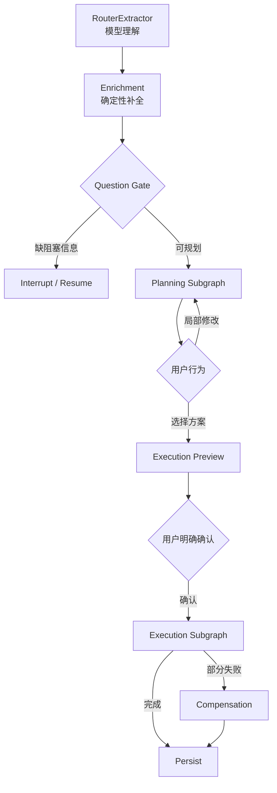

# HappyFreeTime 项目价值与技术定位

_用于梳理项目竞争力、Agent Loop 与确定性工作流的取舍 · 仍需用后续评测结果补充_

---

我先给一个不兜圈子的结论：

> 你的担心有一半是对的：当前仓库里旧的 `IntentAgent → SlotAgent → PlannerAgent → ExecutorAgent` 串行多 Agent 设计，放到 2026 年确实有些过时；但“垂直业务用状态图和确定性模块”没有过时。真正决定项目价值的，是你能否把它升级成一个混合式 Agent Harness，而不是有没有写一个 `while tool_call`。

如果只完成 Router/Slot 合并，然后继续由几个名字叫 Agent 的模块串行运行，这个项目吸引力有限。如果完成我们讨论的完整架构，它仍然很适合 AI Agent 应用开发岗位，而且与 coding agent 项目形成很好的区分。

**你的趋势判断哪里是对的**

在下面这些任务里，单模型 Agent Loop 已经明显比固定工作流更合适：

- Coding Agent
- 深度研究
- 浏览器自动化
- 通用电脑操作
- 开放式数据分析
- 难以提前预测步骤数量的长任务

因为这些任务有几个共同特征：

```
目标明确，但路径未知
动作空间很大
每一步都能观察环境反馈
模型可以根据反馈重新决策
很难提前画完整流程图
```

典型循环是：

```
while not done:
    context = observe_environment()
    action = model.decide(context, tools)
    result = execute(action)
    update_context(result)
```

Coding Agent 尤其适合，因为编译器、测试、Git Diff 和终端输出提供了高质量反馈。你另一个 coding agent 项目应该重点讲这个方向。

旧式多 Agent 架构也确实存在问题：

```
Intent Agent 理解一次
Slot Agent 又理解一次
Planner Agent 再理解一次
多个 Prompt 重复传递压缩后的上下文
每一层都可能损失信息
延迟和 Token 成本不断累积
```

所以“为了职责划分，把每个函数包装成一个 Agent”已经不太有吸引力。

**但 Harness 不等于自由 Loop**

这是最容易被行业话术混淆的地方。

OpenAI 所说的 Harness Engineering，核心是给 Agent 建立可操作环境、反馈机制、验证手段和工程约束，并不是宣布所有业务都必须使用单模型无限循环。[OpenAI Harness Engineering](https://openai.com/index/harness-engineering/)

Anthropic 对 Workflow 和 Agent 的区分也一直是：

- Workflow：LLM 和工具由预定义代码路径编排。
- Agent：模型动态决定过程和工具使用。

它同时建议根据任务选择最简单且有效的方案，很多生产系统会混合两者，而不是追求最大自治。[Anthropic Building Effective Agents](https://www.anthropic.com/research/building-effective-agents)

因此：

```
Loop 是决策结构
Graph 是状态与控制结构
Harness 是支撑整个系统可靠运行的环境
```

三者不是互斥关系。

一个系统完全可以是：

```
外层 LangGraph：
管理反问、确认、恢复、降级和补偿

内部局部 Loop：
处理开放式需求理解或复杂方案修订

确定性 Service：
计算路线、预算、营业时间和订单状态
```

**另外两个同题项目并不是真的都靠 Loop**

这是我根据代码得出的结论，不是看 README 标题。

`meituan-main`：

- 默认生产路径是五阶段固定 Pipeline。
- 真正的 Agent Loop 是额外演示接口。
- Loop 执行后又调用固定 Pipeline 获取结构化结果。
- README 自己报告 Loop 约 30 秒，固定链路约 2 秒。

所以它实际上是在用 Workflow 解决生产任务，用 Loop 展示 Agent 概念。

`xiaoman`：

- `XiaomanAgent.route()` 主要通过关键词 `if/else` 路由。
- 核心规划是固定路线配方、规则检索、约束校验和蒙特卡洛模拟。
- LLM 主要用于少量槽位抽取和闲聊。
- 写操作、权限门、退款和记忆都是确定性代码。

它叫“单主循环 Harness”，但核心不是模型不断自主选择工具。它最大的优势是产品完整度、叙事和交互，而非 Loop 自治程度。

所以不要被项目 README 中的“Agent Loop”标签反向影响架构判断。

**为什么本地生活规划不适合完全自由 Loop**

你的任务和 Coding Agent 不一样。

本地生活规划包含大量可精确计算的约束：

```
营业时间
路线时长
预算
年龄限制
库存
天气适配
预约状态
订单金额
退款状态
```

如果让 LLM 自由循环处理这些问题：

```
LLM 决定先搜什么
→ 调搜索工具
→ 决定再查什么
→ 调路线工具
→ 决定是否满足预算
→ 再调用校验
→ 可能遗漏某项检查
```

你会得到：

- 相同输入的调用路径不稳定。
- 更高延迟和 Token 成本。
- 某些轮次忘记查询营业时间或库存。
- 失败原因难以定位。
- 很难保证写操作授权。
- 自动评测复杂。
- 模型升级后行为可能漂移。

而这些约束并不需要模型的创造力。模型真正不可替代的是：

- 理解口语化需求。
- 识别显式与隐式偏好。
- 理解用户对已有方案的修改意图。
- 在无固定模板时生成活动类型骨架。
- 解释方案差异和取舍。
- 进行自然对话。

因此最合理的是“自治预算”分配：

```
高自治：
自然语言理解、模糊偏好、开放式方案意图

低自治：
预算、路线、营业、库存、权限、订单、退款
```

**你的 V2 应该如何避免显得像旧 Workflow**

关键不是去掉 Graph，而是让 Graph 只承担真正有价值的流程：



这张图不是为了展示节点数量，而是表达：

- Graph 可以中断并恢复。
- 用户可以多轮调整。
- 方案选择和执行确认分离。
- 外部工具可以降级。
- 写操作失败可以补偿。
- 服务重启后可以续跑。

这些确实是普通单轮 Loop 不自动提供的能力。

**要不要加一个真正的 Agent Loop**

可以，但不要为了简历强行塞进去。

我建议后续增加一个“受限的规划修复循环”，而不是让 Loop 接管全系统：

```
Planner 生成候选方案
→ Verifier 返回结构化问题
→ Repair Controller 判断：
   1. 换候选
   2. 放宽软约束
   3. 调整路线骨架
   4. 请求用户修改硬约束
→ 最多循环 2-3 次
```

形式上：

```
for attempt in range(MAX_REPAIR_ROUNDS):
    plans = planner.generate(constraints, feedback)
    report = verifier.verify(plans)

    if report.has_valid_plan:
        break

    feedback = repair_controller.decide(report)
```

这里可以让模型参与“如何修复”的语义决策，但：

- Verifier 仍由代码实现。
- 最大循环次数固定。
- 权限门不能绕过。
- 每次动作都有结构化 Schema。
- 无法解决时回到用户，不无限循环。

这是真正有业务价值的 bounded agent loop，也符合当前趋势。

不过首版不必立即实现。先完成可靠主链路，再通过评测证明是否真的需要它。

**项目对面试官的实际吸引力**

我会这样客观分档：

| 完成状态                              | 吸引力                   |
| ------------------------------------- | ------------------------ |
| 当前旧 Graph + 命令行 + 多 Agent 名称 | 较弱                     |
| Router 合并 + Mock 搜索 + 规则方案    | 普通课程项目             |
| 完整前端 + 高德 + 多站规划 + 确认执行 | 有竞争力                 |
| 再加恢复、降级、幂等、补偿、局部调整  | 很适合 Agent 应用岗      |
| 再加可复现评测和新旧架构数据          | 明显亮点                 |
| 只为了潮流换成自由 Loop               | 未必加分，可能降低可信度 |

面试官真正可能感兴趣的问题是：

- 为什么没有让模型直接规划？
- 哪些决策交给模型，哪些交给代码？
- 怎么避免重复下单？
- 外部 API 失败怎么办？
- 用户确认如何保证有效？
- 多轮任务如何恢复？
- 如何证明新架构比旧架构更快、更可靠？
- Mock 后端如何替换为真实能力？
- Graph 在这里解决了什么普通函数不能很好解决的问题？

如果你能用代码和数据回答这些问题，这比“我也实现了一个 ReAct Loop”更有区分度。

**M2 D0-D3 现在可以怎么讲**

这次整单验证不是“又加了一条 if”，而是解决候选生成与真实可执行性之间的两阶段一致性问题：Catalog 只能用请求时间窗做低成本粗筛；真实路线返回后，到店时间会变化，必须由独立 `PlanVerifier` 重新证明每个停靠点的完整停留区间仍在营业时段内。高分候选只要违反硬约束就淘汰，评分不能覆盖验证结论。

一个适合面试的 60 秒表达是：

> 我把规划拆成低成本的结构搜索和高成本的事实复核。Catalog 先按单资源事实剪枝，确定性 PlanningIntent 再从四个版本化骨架中保留适合时间窗与节奏的 2/3/4 站结构；多站每个角色先预排序到 8 个候选，再完整枚举，所以四站不是对 200 条 POI 直接做近亿级笛卡尔积。只有 finalist 才请求 Route Provider，路线重建后由 PlanVerifier 检查时间窗、指定时长、单段距离和完整营业覆盖。外部调用统一限制为 24 个 Route Leg，并在不同骨架之间轮询，避免高分长骨架耗尽预算。这样既保留了穷举的可解释性，也解决了真实路线失效造成的假性无解和多站 API 成本失控。

可以进一步展开的工程取舍：

- **为什么不让 LLM 判断营业：** 开关门边界和时间包含关系可精确计算，确定性规则更可测、可复现，也不会因模型升级漂移。
- **为什么不是全量路线矩阵：** 200 条 POI 的多站排列会迅速放大外部 API 成本；本地角色池、完整枚举和有界 finalist 复核把搜索完整性与调用预算分开管理。
- **为什么现在不用 Beam Search：** 最多四站且每角色最多 8 个候选时，唯一四站排列约 3,136 个，本地穷举仍可控且更容易复现；只有 eval 证明延迟或组合数超阈值后才值得换 Beam。
- **为什么不只验证 Top-3：** 本地直线距离和估算时长只是近似，真实路线或实际到店营业检查会让高分候选失效，固定 Top-3 会制造假性无解。
- **如何处理不完整数据：** 同日逗号分隔营业区间可以严格解析；`PH`、跨夜和其他未支持表达不做部分猜测，而是降为 Unknown/Warning，不能冒充已验证事实。
- **如何聚合无解原因：** 优先报告所有已尝试候选共有的硬约束，再给与字段对应的放宽建议，避免把某个候选的偶发次要问题当成全局原因。

当前可量化证据是：版本化 Catalog 有 200 条 POI，其中 10 条保留多营业区间；多站角色池最多 8 个候选，四站唯一排列上限约 3,136 个，外部复核最多 24 个 Route Leg（含返程）；后端全量回归为 121/121（另含 2 个 subtests），9 条离线 smoke 通过，其中 6 条硬约束路径为 6/6；200 条快照全天请求冒烟约 2.25 秒；真实 Key 已完成路线、天气和浏览器地图的最小联调，历史会话、刷新与前进/后退也完成一次真实本地浏览器回归。边界也要主动说明：单次真实联调不等于 SLA，浏览器步骤尚未固化为仓库内 E2E，也没有证明节假日、跨夜、实时闭店或库存。

现阶段更准确的简历句子可以写成：

> 设计确定性 Planner/Verifier 两阶段规划链路，以版本化角色骨架支持 2/3/4 站规划；通过每角色 Top-8 有界枚举与含返程的 24 Route Leg 公平预算控制组合及外部调用成本，基于真实路线重建时间线并校验营业、餐时、返程与距离硬约束，以 121 条后端回归与 9 条离线 smoke 守住结果语义。

**最终定位建议**

不要在简历上写：

> 基于 LangGraph 搭建 Intent、Slot、Planner、Executor 多 Agent 协作系统。

建议写成：

> 构建面向本地生活规划的状态化 Agent Harness，结合结构化语义理解与确定性约束规划，支持多站路线、Human-in-the-loop、外部工具降级、任务恢复、局部重规划及交易补偿；通过可观测 Trace 对比架构优化前后的 LLM 调用次数、延迟和任务成功率。

这不是掩饰 Workflow，而是准确表达你的工程价值。

最重要的判断是：

> 旧版本确实需要升级，但项目选题和 LangGraph 本身没有过时。你的差异化不应是再造一个通用 Loop，而是证明你知道何时应该让模型自主、何时必须由软件工程接管。对于 AI Agent 应用开发岗位，这恰恰是成熟度的体现。
