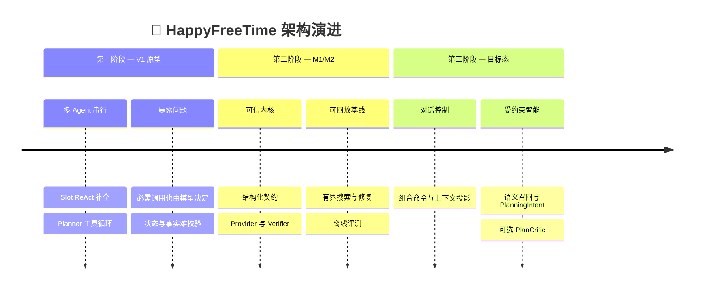

# HappyFreeTime 三阶段架构演进：从 ReAct 原型到受约束规划 Agent

_面试讲稿与追问题库 · 区分历史事实、当前实现和待验证目标 · 更新于 2026-09-05_

---

## 📋 一页结论

### 30 秒版本

HappyFreeTime 经历了三次架构思考。第一阶段用 `IntentAgent → SlotAgent → PlannerAgent → ExecutorAgent` 验证 LangGraph、工具调用和中断恢复，但把时间、位置、天气等必需步骤也交给模型循环，调用慢、状态松散，方案事实缺少独立校验。第二阶段把系统重构为 `Router → Enrichment → Gate → Planning`：模型负责理解语言，确定性 Provider、Planner、Verifier 和 Repair Contract 负责事实、搜索与硬约束，建立了可回放的可信基线。这个版本可靠，但又暴露出相反问题——模型几乎不影响实际方案，精确时间、单站晚饭、模糊偏好和局部修改都容易退化成关键词或固定分支。

第三阶段因此不是恢复全流程 ReAct，而是在可信内核外增加状态化对话控制，在规划内部增加受约束的语义决策：模型可以解释组合式命令、提出只读信息需求、形成 `PlanningIntent`，以及在已经通过 Verifier 的方案间评价软取舍；Harness 继续掌握硬约束、必需工具、预算、终止和副作用。核心不是“增加几个 Agent”，而是把自治权放在模型真正有优势且可验证的决策 Seam 上。

### 面试时最重要的三句话

1. **V1 的问题不是用了 LLM，而是没有区分“语义决策”和“必做的机械步骤”。**
2. **V2 的价值不是把 Agent 做没了，而是先建立了不会被模型绕过的可信规划内核。**
3. **第三阶段不是追求最大自治，而是追求有业务收益、可回放、可降级的有效自治。**

### 版本命名边界

仓库对外仍沿用 V2 Roadmap；本文所说的“第三阶段”或“目标态”是第三代架构思路，不代表已经发布了一个完整 V3。当前代码应准确描述为 **Graph Workflow + 确定性可信规划内核**。只有完成 M3 的对话控制、语义规划影响和消融评测后，才适合称为 **受约束规划 Agent**。这一边界已记录在 [架构 ADR](../adr/0001-constrained-hybrid-agent-graph.md) 中。

## 🔄 三个阶段的演进

_时间线概括了 HappyFreeTime 从黑客松 ReAct 原型、到 M1/M2 可信工作流，再到待实施的受约束混合 Agent Graph 的演进，以及每次调整要解决的主要矛盾。_

| 阶段 | 模型负责什么 | 代码 / Harness 负责什么 | 主要收益 | 主要遗留问题 |
| --- | --- | --- | --- | --- |
| V1：ReAct 原型 | 意图、补全、工具选择、方案生成、部分执行判断 | 执行模型请求的工具，保存简单 Graph 状态 | 快速验证 Agent Loop、工具调用和 interrupt | 调用冗余、输出松散、事实和方案混合、缺少独立不变量 |
| V2：可信规划工作流 | 一次结构化意图与约束抽取；可选文案解释 | Enrichment、Provider、骨架、组合、路线、Verifier、Repair、持久化 | 可测试、可降级、硬约束可信、离线可复现 | 模型几乎不影响候选召回、结构和最终排序；对话与修改能力弱 |
| 第三阶段：受约束混合 Agent | `ConversationCommand`、可选 `InformationNeed`、`PlanningIntent`、可选 `PlanCritic` | 上下文投影、必需 Provider、结构编译、硬约束、预算、实际终止、权限与副作用 | 模型真正影响方案，同时保留 V2 的可信边界 | 尚待实现和评测；复杂度必须通过收益证明 |

### V1：先验证 Agent 形态

V1 的 [Graph](../../Agents/graph.py) 串联 Intent、Slot、Planner 和 Executor。其 [SlotAgent](../../Agents/SlotAgent/slot_agent.py) 是一个 ReAct Agent，提示词要求先调用当前位置和当前时间，再调用天气；其 [PlannerAgent](../../Agents/PlannerAgent/planner_agent.py) 允许模型在最多三轮中选择搜索活动、餐厅、商品和路线工具，再直接输出方案 JSON。

这对黑客松原型是合理的：功能边界尚未稳定时，模型能够快速把多个 Tool 组合起来，团队也能验证 LangGraph、interrupt、工具封装和结构化输出是否跑通。V1 不是“错误架构”，而是探索阶段为了尽快获得反馈而采用的 Implementation。

V1 真正推动重构的不是某一个 Bug，而是同一种职责混合在不同位置反复出现：

| V1 具体设计 | 典型问题 | 根因 |
| --- | --- | --- |
| Slot 提示词要求模型先调当前位置、当前时间，再查天气 | 即使这些事实对规划是必需的，也要经过模型观察和下一轮决策；模型少调会缺事实，多调又浪费延迟 | 把固定依赖误当成开放决策 |
| Planner 先由模型选搜索工具，再由同一模型拼时间线和总价 | 生成者同时承担事实整合与可行性判断，没有独立 Verifier 证明营业、路线和预算成立 | 方案提出与约束裁决没有分层 |
| 输出依赖自由 JSON，解析失败时再调用一次模型修复 | 格式错误会增加额外调用；最终 fallback 甚至可能返回占位方案，失败容易伪装成成功 | 缺少强 Schema 和显式失败语义 |
| Graph 通过自由 `TypedDict` 和嵌套字典传递 intent、slot、plans、execution | 字段名和含义可以跨节点漂移，调用方很难在边界处验证 | Module Interface 太宽且不稳定 |
| `MemorySaver` 保存控制流，执行状态仍缺少业务事实源 | 进程恢复、会话历史、幂等执行和审计无法只靠 Graph checkpoint 保证 | 控制状态与业务状态没有分开 |
| Slot 使用 `recursion_limit=30`，Planner 另设最多三轮 | 虽然有防无限循环上限，但缺少“信息增益”“重复观察”和全局成本预算 | 只有技术循环上限，没有业务停止合同 |

因此 V1 → V2 不是简单地“少调用几次模型”，而是一次职责重划分：

| V1 问题 | V2 对应改造 |
| --- | --- |
| 必需事实也由模型决定是否调用 | Enrichment 与 PlanningService 确定性调度 Geocoding、Weather、Route、Availability Provider |
| 自由字典和手工 JSON 修复 | Pydantic 领域契约、`extra="forbid"`、结构校验失败后安全澄清 |
| 模型直接写最终方案并自行判断可行性 | 确定性候选生成与独立 PlanVerifier 分离，硬约束评分不可覆盖 |
| 工具失败和数据缺失容易静默兜底 | `violation / conflict / warning / tradeoff` 分层，并记录来源、降级和陈旧状态 |
| 重试没有统一归因和预算 | Repair Contract 统一为 `LOCAL_REPLACEMENT / NEXT_FINALIST / TERMINAL`，每条 root chain 最多两轮 |
| checkpoint 被当成全部状态 | SQLite 会话与响应快照保存业务视图，checkpoint 只负责恢复 Graph 控制流 |

### V2：先建立可信的业务内核

V2 将主链重构为 [Router → Enrichment → Gate → Planning](../../app/orchestration/entry_graph.py)。跨 Module 数据改成 Pydantic 契约；天气、地理编码、路线和可用性成为可替换 Provider；Planner 只组合目录内资源，真实路线重建后由独立 Verifier 裁决，失败再进入有预算的 Repair Contract。

到 M2 收口时，系统已有四个版本化 2/3/4 站骨架、每角色 Top-8 的有界枚举、24 Route Leg 预算、最多两轮局部修复，以及 19 条离线 smoke，其中 13 条硬约束路径全部通过。这里的指标证明的是 **可信规划基线已经成立**，并不证明固定骨架或关键词召回已经达到最佳语义质量。详细证据见 [M2 状态文档](../status/m2_trustworthy_planning_plan_2026-08-20.md)。

### 第三阶段：在正确位置恢复模型决策

第三阶段保留 `PlanningService`、Provider、Verifier 和 Repair 的深 Module，只在新的业务需求已经穿透旧 Interface 时增加能力：

- `TurnInterpreter` 把自然语言解释为组合式 `ConversationCommand`，而不是继续扩充互斥 Intent 枚举。
- `ContextAssembler` 针对当前决策投影活跃方案、相关历史和可用记忆，不把全量聊天重新塞给每个模型节点。
- 模型可提出白名单只读 `InformationNeed`；`ToolBroker` 校验参数、权限、预算、重复观察和停止条件。
- `PlanningIntent` 影响语义查询、角色覆盖、站数范围、节奏和软排序；确定性 `StructureCompiler` 只编译合法结构。
- 可选 `PlanCritic` 只重排已通过 Verifier 的 finalist，不能复活硬约束违规方案。
- RAG 通过 `CandidateRetriever` 增强模糊体验召回；MCP 只是 Capability Adapter，不侵入领域契约。

完整目标结构见 [架构设计](../canonical/architecture_v2.md)，实施顺序见 [Roadmap](../canonical/v2_roadmap.md)。

## 🔍 为什么 V2 仍需要调整

V2 解决了“可信不可信”，却还没有充分解决“懂不懂用户”和“能不能自然修改”。这不是一个抽象的“LLM 参与太少”问题，而是可以从当前契约和反例中定位的能力缺口。

| 用户表达 | 当前机制的结构性限制 | 可能结果 | 第三阶段需要的能力 |
| --- | --- | --- | --- |
| “下午两点半出发” | 当前时间模型主要是 `time_window + duration + return_by`，没有独立的 `departure_at` 语义 | 精确出发点可能被压成普通时间窗，无法区分“可用时段”和“必须出发时刻” | 一等时间约束与对应解析 Eval |
| “只帮我安排一家晚饭” | 当前 `PlanningIntent.minimum_stops=2`，四个骨架均从两站开始 | 为满足模板而强行附加活动，或无法自然表达任务 | 1–4 站规划语法与单角色结构 |
| “带父母出去玩，想有新鲜感但别太累” | 当前规则主要依赖有限偏好词集合和 Catalog 标签匹配 | “新鲜感”“父母不累”难映射到具体体验证据，召回质量受标签覆盖限制 | 语义查询、评论 aspect 摘要和 Hybrid RAG |
| “第二站换近一点，餐厅保留” | 当前 `Interpretation` 只有自由文本 `target_reference`，没有 Patch、locks 和 PlanDiff | 容易重新规划整单，无法证明只改了用户要求的部分 | `TargetReference + ConstraintPatch + locks` |
| “为什么首选它？和第二个比呢？” | 当前 Graph 没有稳定的 Inquiry / Explanation 子图 | 查询、比较和规划容易继续堆进顶层 Intent 或 API 特例 | 组合式命令与稳定 Capability Subgraph |
| “天气怎么样？如果下雨就改室内” | 天气是 Planner 的必需 Provider，但“查询事实”和“以事实修改方案”是两种操作 | 单个 Intent 无法同时清晰表达查询、条件和修改目标 | operation、subject、condition、patch 的组合命令 |

这些结论有三种证据来源：

1. **契约证据：** 当前 [RawConstraints / Interpretation / NormalizedConstraints](../../app/domain/constraints.py) 中没有 `departure_at`、结构化 Patch 和 locks。
2. **控制流证据：** 当前 [Entry Graph](../../app/orchestration/entry_graph.py) 只有三个规划意图进入 Planner，尚无 Inquiry、Explanation 和 Execution 的稳定子图。
3. **算法证据：** 当前 [PlanningService](../../app/services/planning.py) 使用四个显式骨架、规则构造 `PlanningIntent` 和标签匹配；这些机制可复现，但无法天然获得开放语义相似度。

因此，架构调整不是因为“Agent 更潮”，而是因为新增需求已经在多个位置重复制造同一种压力：Intent 枚举膨胀、上下文不足、固定骨架不适配、关键词召回脆弱、修改没有局部性。继续增加 if/else 能解决个别示例，却会降低 Locality，让同一语义在 Router、Planner、前端和测试中被重复编码。

## 🤔 我是如何判断调整必要且方向更优

### 第一步：区分不变量与启发式决策

先不讨论“用不用 LLM”，而是把决策按错误代价和可计算性拆开：

| 决策 | 特性 | 归属 |
| --- | --- | --- |
| 营业时间包含、预算上限、路线时长、最晚返程 | 可精确计算；错误会让方案不可执行 | 确定性代码与 Verifier |
| 地理编码、天气、路线、库存 | 对某类任务是必需事实；不调用会缺证据 | Harness 调度 Provider |
| “新鲜感”“松弛”“适合聊天”的理解 | 语言开放、难以枚举、需要语义概括 | 模型与语义检索 |
| 用户是在查询、修改还是执行，修改哪一站 | 依赖对话语境和指代 | `ConversationCommand` |
| 合法站数、角色和先后关系 | 同时包含语义偏好与业务合法性 | 模型提出 Intent，代码编译合法结构 |
| 是否结束、是否允许写操作 | 需要模型表达意图，但错误代价高 | 模型提出，Harness 最终裁决 |

这一步得到的原则是：**模型负责不可穷举的语义判断，Harness 负责事实、不变量和行动边界。**

### 第二步：比较四个可选方案

| 方案 | 优点 | 缺点 | 结论 |
| --- | --- | --- | --- |
| 继续纯 V2 Workflow | 最稳定、最低延迟、易测试 | 模糊语义与定向修改继续变成关键词和分支 | 保留为 fallback，不作为最终目标 |
| 恢复全流程 ReAct | 模型自治强、实现表面统一 | 必需工具也进入无收益循环；路径、成本和遗漏不稳定 | 否决 |
| 拆成多个角色 Agent | 叙事直观，可以分 Prompt | 没有独立权限、数据所有权或异步目标，交接成本大于收益 | 当前否决 |
| 受约束混合 Agent Graph | 语义决策真实影响方案，同时复用可信内核 | 需要新契约、上下文与评测，系统复杂度会上升 | 选择，但按里程碑渐进启用 |

### 第三步：用 Module 深度和删除测试控制复杂度

新架构不为每个 Provider 建 Graph 节点，也不建立 Context Agent、StructureRanker Agent 或一个 Agent 对应一个 Tool。稳定 Interface 只放在真正需要独立演进的位置：

- `ContextAssembler.build(...) -> DecisionContext`
- `ToolBroker.execute(...) -> ToolObservation`
- `CandidateRetriever.retrieve(...) -> CandidatePool`
- `PlanningService.plan(...) -> CandidateSet`

它们是小 Interface、深 Implementation。若删除 LLM `PlanningIntent` Adapter，规则实现仍可规划；若删除 RAG Adapter，标签检索仍可工作；若删除 MCP Adapter，本地 Capability 不受影响；若关闭 PlanCritic，Verifier 和确定性排序仍然成立。这种可删除性说明新 Seam 是隔离变化，而不是把复杂度散到全系统。

### 第四步：把“更优”写成可证伪假设

现在能判断的是“V2 存在结构性能力缺口，混合方案比另外三种方案更符合约束”，还不能声称“第三阶段已经在指标上更优”。更成熟的表达是：

> 我没有在实现前宣布新架构获胜，而是先保留确定性基线，把每个新增模型能力做成可关闭 Adapter，再用冻结案例和消融决定它能否默认开启。

这使架构选择可以被后续数据推翻，而不是只能靠主观审美维护。

## ⚙️ 新架构如何分配模型与 Harness

| 环节 | 模型可做的决策 | Harness 的边界 |
| --- | --- | --- |
| 对话解释 | operation、subject、target、Patch、locks、requested facts、continue/ask/finish proposal | Schema 校验、置信门槛、状态合法性、实际路由和停止 |
| 上下文 | 不直接选择任意数据库内容 | `ContextAssembler` 按 purpose、Actor scope 和 token 预算生成投影 |
| 工具 | 为可选语义问题提出 `InformationNeed`，选择白名单只读能力 | 必需 Provider 自动调度；参数、去重、超时、轮数、敏感字段由 `ToolBroker` 管理 |
| 结构 | 提出 required/optional roles、precedence、count range、pace 和 themes | Constraint Strength、合法结构与时间可行性由代码编译 |
| 检索 | 生成语义查询，解释证据相关性 | 元数据硬过滤、来源、去重、top-k 和 fallback 由 Retriever 控制 |
| 方案评价 | 在 verified finalist 间评价软偏好和体验连贯性 | 不得修改事实、不得放宽硬约束、不得复活违规方案 |
| 执行 | 理解用户想确认或取消什么 | 确认快照、幂等、权限、Saga 和写操作完全由 ExecutionGraph 管理 |

这套架构可以称为 Agent，但要满足两个前提：

1. 模型的决策会真实改变允许范围内的控制流、信息获取、候选结构或排序，而不只是生成文案。
2. 系统保留 Harness 对实际动作、预算和终止的最终控制，并能回放模型为什么作出该决策。

它也可以称为 Graph Engineering。Graph Engineering 不等于“多个 Agent 按图连接”，而是把长生命周期任务建模成显式状态、分支、中断、恢复、重试预算和副作用边界。目标形态中的 MainGraph 与 Inquiry、Planning、Explanation、Execution 子图具有不同状态和恢复语义，因此 Graph 有实际控制价值；普通 Provider 调用仍留在深 Service 内，不为了画图而节点化。

## 📊 没有历史 A/B 指标，面试时怎么回答

### 先承认指标边界

最诚实的结论是：

- V1 没有完成稳定产品链路，也没有冻结输入集、模型版本、工具回放和 Trace，因此没有可信的 V1/V2 延迟与成功率 A/B。
- M2 的 19/19 smoke、13/13 硬约束路径和 Demo World 200/200 字段覆盖，证明 V2 的可靠性与数据闭环，不证明第三阶段的语义收益。
- 第三阶段目前是 accepted design，还没有实现，所以不能写“提升召回率 X%”或“延迟下降 Y%”。

这不是致命缺陷。架构决策可以先由反例、契约缺口和风险分析驱动，但默认启用新能力必须再由实验支撑。真正的问题不是“当时没有指标”，而是之后仍然不建立基线、却编造收益。

### 现在已有的证据能证明什么

| 证据 | 可以支持的结论 | 不能支持的结论 |
| --- | --- | --- |
| V1 代码中的 ReAct、最多 30 recursion limit、Planner 最多三轮 | 旧设计存在多轮调用和非确定路径的结构性成本 | 真实线上平均延迟一定是多少 |
| V2 Pydantic、Provider、Verifier、Repair 与离线 replay | 硬约束、事实来源和降级可以独立测试 | 用户一定更喜欢 V2 方案 |
| 19 条 smoke、13 条硬约束 100% | 当前冻结案例内的业务不变量成立 | 未覆盖城市、长尾语言和线上 Provider 都成立 |
| 2/3/4 站固定骨架与关键词匹配代码 | 单站、开放语义和局部修改没有一等表达 | 新 LLM 方案一定优于规则基线 |
| 目标 ADR 与可关闭 Adapter | 新设计具备降级和消融条件 | 新设计已经交付 |

### 下一步应冻结的评测矩阵

| 假设 | 对照组 | 核心指标 | 失败条件 |
| --- | --- | --- | --- |
| `ConversationCommand` 比旧 Intent 更适合多轮修改 | 旧 `Interpretation` vs 新命令契约 | operation/subject 准确率、TargetReference 命中率、Patch fidelity | 修改错目标，或显著增加澄清轮数 |
| 一等时间模型改善精确时间任务 | 旧 TimeWindow vs 新时间约束 | 精确出发解析率、最终日程满足率 | `14:30` 等表达仍被默认规则覆盖 |
| 1–4 站语法改善任务覆盖 | 四个固定骨架 vs 规划语法 | 场景覆盖率、可行结构率、无意义增站率 | 单站任务仍被强行补站，或结构搜索成本失控 |
| Hybrid RAG 改善模糊偏好召回 | 标签基线 vs BM25/向量混合 vs 可选 rerank | Recall@K、nDCG、人工 pairwise preference、错误证据率 | 质量无稳定提升，或延迟/错误证据不可接受 |
| `PlanCritic` 改善可行方案软排序 | 规则排序 vs 规则 + Critic | 人工偏好 agreement、解释证据一致性 | 触碰 Verifier 结论，或收益小于成本 |
| 只读 Tool Loop 带来有效信息增益 | 无 Loop vs 有界 Loop | 有效工具调用率、重复观察率、平均轮数、任务成功率 | 无收益调用多、超预算或出现循环 |

所有组都必须共同报告 hard constraint pass、P95 延迟、模型调用数、token 成本和降级成功率。硬约束不干扰率、权限和写操作确认等安全指标应保持 100%，不能用语义质量提升交换。

### 面试推荐说法

> 这次调整最初不是由线上指标触发，因为旧版本还没有完整流量链路。我先用代码审查和反例测试确认了几个无法由现有模型自然表达的能力缺口，例如单站晚饭、精确出发时间、锁定餐厅只换第二站、以及“父母不累但有新鲜感”的召回。这个证据足以说明需要改变契约，但不足以证明新实现一定更优。所以我保留了 V2 规则基线，把 PlanningIntent、RAG 和 Critic 都做成可关闭 Adapter，并预先定义离线消融和运行成本指标。我的结论不是“新架构已经提升了多少”，而是“新架构让收益可以被客观验证，而且失败时能退回可信基线”。

### 以后可以补做的历史比较

如果希望增强简历证据，可以从 Git 中检出 V1 基线并做一次受控复现实验，但应明确它是“事后复现”，不是当时的线上数据：

1. 冻结 30–50 条相同输入，包括普通规划、缺字段反问、天气查询和修改方案。
2. 固定模型、温度、超时、Mock/Replay 工具结果与机器环境。
3. 每条至少运行多次，报告成功率、P50/P95 延迟、LLM/Tool 调用数、token 和结构化输出失败率。
4. 对 V1 和 V2 分别标明功能覆盖差异，不能把 V1 尚未实现的功能简单计为性能失败。
5. 在 README 或 Eval 报告中保留配置、原始 Trace 和失败样本。

## 🎓 面试主叙事与高频追问

### 两分钟 STAR 讲稿

**Situation：** 黑客松原型使用多个 Agent 和 ReAct 工具循环，能跑通自然语言到方案的演示，但时间、位置、天气等必需步骤也需要模型决定；方案由模型直接组装，缺少独立事实和硬约束校验。

**Task：** 比赛结束后，我希望把项目改造成能在简历上经得住系统设计追问的本地生活规划 Agent：既要让结果可执行、可回放，也要保留模型处理复杂语义和多轮修改的价值。

**Action：** 我先做 V2，把自然语言理解和确定性计算拆开，用 Pydantic 契约连接 Router、Enrichment、Provider、PlanningService 和 Verifier；真实路线只复核 finalist，动态失败进入最多两轮的 Repair Contract。建立可信基线后，我又用精确时间、单站晚饭、模糊偏好和局部修改四类反例审查 V2，发现继续加规则会让语义逻辑散落。于是设计第三阶段：一个语义入口、按用途裁剪的 DecisionContext、白名单只读 ToolBroker、可影响结构和召回的 PlanningIntent，以及只评价 verified finalist 的 PlanCritic。硬约束、必需 Provider、预算、停止和副作用仍由 Harness 掌握。

**Result：** 已完成的结果是 V2 的可回放可信规划基线；第三阶段的结果目前是 accepted ADR、稳定 Interface 和可证伪评测设计，不能冒充实现收益。下一步会用规则、RAG、PlanningIntent 和完整决策层四组消融，决定哪些 Adapter 值得默认开启。

### 为什么不继续用全流程 ReAct？

本地生活规划里，地理编码、天气、路线和营业校验往往是必需步骤，它们是否执行不需要模型创造力。全流程 ReAct 会让模型反复决定必做动作，增加调用、遗漏和漂移风险。模型更适合决定模糊语义、对话指代、可选信息需求和软取舍，因此我只在这些位置给自治预算。

### 为什么 V2 不直接让 LLM 生成最终行程？

LLM 可以提出结构意图和评价体验，但不能可靠计算跨站路线、完整营业覆盖、预算和返程边界。让它直接写最终时间线，会把事实生成和事实验证混在一个 Module。V2 先把 Planner 与 Verifier 分离，是后续安全引入模型的前提。

### 既然大量步骤写死，为什么还能叫 Agent？

Agent 的关键不是所有步骤都由模型决定，而是模型能基于状态作出会真实影响任务推进的决策。完成第三阶段后，模型能决定组合式命令、可选信息需求、规划语义和 finalist 软排序；Harness 只限制合法动作空间并验证结果。这属于受约束 Agent，而不是自由 Loop。当前 M2 尚未完成这些能力，所以只称 Graph Workflow。

### 为什么能叫 Graph Engineering，而不是普通 Workflow？

因为 Graph 承载的是会话状态、Capability 分流、interrupt/resume、局部修改、确认、失败修复、预算终止和执行补偿，而不是把普通函数画成节点。Inquiry、Planning、Explanation、Execution 有不同的进入条件和恢复语义；Provider 内部计算没有分支价值，所以仍留在 Service 中。

### 为什么不做多 Agent？

当前没有多个真正独立的目标、权限边界、生命周期或知识所有权。把 Interpreter、Retriever、Planner 和 Critic 都包装成 Agent 只会增加 Prompt 交接和状态漂移。先用一个受约束决策层和多个深 Module 更符合问题结构；只有未来出现独立异步研究、独立权限域或长期并行目标，才重新评估多 Agent。

### RAG 是不是为了简历硬加技术？

不是。它对应“父母不累但有新鲜感”“适合认真聊天”等标签难以穷举的真实召回缺口。但 RAG 只做 Candidate Retrieval，结构化硬过滤仍在前，Verifier 仍在后；它必须相对标签基线在 Recall@K、nDCG 或人工偏好上有稳定收益，否则保持关闭。

### MCP 在这里解决什么？

MCP 解决 Capability 的发现与调用协议，不解决领域建模。内部仍依赖 `InformationNeed`、`ToolObservation` 和 Provider Interface；以后接外部活动、票务或内容检索 MCP，只需增加 Adapter，不能绕过 Actor scope、预算、Verifier 和执行确认。

### 为什么需要 ContextAssembler，直接拼接历史不行吗？

修改、记忆和解释确实需要上下文，但不同模型节点需要的内容不同。TurnInterpreter 需要最近相关对话与活跃方案引用，PlanningIntent 需要合并后的约束、相关记忆和前置事实，PlanCritic 只需要少量 verified finalist。全量历史会增加 token、噪声和隐私风险，因此上下文应是按 purpose 构建的临时投影，而不是另一个决定路由的 Agent。

### 这次是不是过度设计？

风险存在，所以采用渐进式门槛：先实现组合命令、精确时间和局部修改，再实现语义 PlanningIntent 和最小 Hybrid RAG，最后才考虑默认开启 Critic 或 MCP。每一层都可删除、可回退，并要求单独 Eval。若消融没有收益，该 Adapter 不进入默认链路。

### 上一个版本是不是做错了？

不是。V1 优化探索速度，V2 优化可信度，第三阶段优化受约束的语义能力。没有 V2 的 Provider、Verifier、Replay 和评测基线，直接增加 RAG 或 Critic 反而无法判断模型是否在改善方案，还是在掩盖错误。架构演进是目标变化后的再平衡，不是对旧工作的否定。

### 最大的工程难点是什么？

不是调用模型，而是划分决策权：既要让模型真实影响方案，避免它退化为文案层；又不能让模型决定营业、预算、路线和写操作。为此需要领域契约、上下文投影、Capability 预算、确定性 fallback、Verifier 不变量和消融评测同时成立。

## 📌 复盘、证据与使用建议

### 可以在简历中使用的架构表述

在第三阶段尚未完成前：

> 构建基于 LangGraph 的本地生活规划工作流，将结构化语义理解与确定性可信规划解耦；通过可回放 Provider、版本化多站骨架、真实路线复核、独立 Verifier 和有界 Repair Contract，保证时间、路线、营业、预算及动态可用性约束。

第三阶段完成并通过消融后：

> 设计受约束混合 Agent Graph：由模型解释组合式对话命令、提出只读信息需求并形成 PlanningIntent，实质影响语义召回、合法结构候选和 verified finalist 排序；Harness 统一管理上下文投影、工具预算、硬约束、终止、权限与副作用，并以规则 / RAG / LLM 消融验证收益和降级能力。

### 不要说的内容

- 不要把当前 M2 说成“LLM 自主选择工具并规划”，实际 Planner 仍是确定性实现。
- 不要把四个顺序骨架说成通用 N 站规划语法。
- 不要把 Mock/Replay Availability 说成真实库存。
- 不要声称第三阶段已经提升召回率或降低延迟，除非后续有冻结报告。
- 不要用“多个 Agent”解释 Graph Engineering；要讲状态、分支、恢复、预算和副作用。
- 不要把测试通过率等同于真实用户满意度。

### 仓库证据索引

| 证据 | 用途 |
| --- | --- |
| [V1 Graph](../../Agents/graph.py) | 证明早期 Intent / Slot / Planner / Executor 控制流 |
| [V1 SlotAgent](../../Agents/SlotAgent/slot_agent.py) | 证明 ReAct 与时间、位置、天气 Tool 调用设计 |
| [V1 PlannerAgent](../../Agents/PlannerAgent/planner_agent.py) | 证明早期模型选工具并直接生成方案的设计 |
| [当前 Entry Graph](../../app/orchestration/entry_graph.py) | 证明 Router / Enrichment / Gate / Planning 与 interrupt |
| [当前约束契约](../../app/domain/constraints.py) | 证明现有时间、上下文和修改表达边界 |
| [当前 PlanningService](../../app/services/planning.py) | 证明显式骨架、规则 Intent、Provider、Verifier 与 Repair |
| [V2 差距历史快照](../status/v2_gap_analysis_2026-08-12.md) | 复盘 V1 到 V2 的问题识别和迁移策略 |
| [M2 可信规划状态](../status/m2_trustworthy_planning_plan_2026-08-20.md) | 证明 V2 已完成能力、指标和边界 |
| [目标架构](../canonical/architecture_v2.md) | 查看第三阶段完整领域模型、Graph、RAG、MCP 和评测设计 |
| [架构 ADR](../adr/0001-constrained-hybrid-agent-graph.md) | 查看备选方案与最终决策 |

### Git 历史锚点

- `fdb7a86`：新增 RouterExtractor 以替换单独 Intent，主线尚未切换。
- `2b9e88f`：建立 M1 应用、Graph、API、SQLite、React 和测试基线。
- `ad4746f`：完成 M2 可信规划与 Demo World 工作区。

这些提交保留了版本演进的代码证据。本文不修改或回滚旧设计，而是把经历过的约束、失败模式、决策理由和待验证假设集中为一份面试叙事。

### 最后的复盘结论

这次演进最值得在面试里讲的，不是“我把 Workflow 改成了 Agent”，而是：

> 我先因为自由 Agent Loop 的延迟和不确定性，把必需事实与硬约束收回确定性内核；随后又发现纯规则内核无法自然覆盖精确语义、模糊体验和局部修改，于是没有走回全流程 ReAct，而是重新划分模型与 Harness 的决策权。最终目标是让模型只在高语义价值的 Seam 上拥有有界自治，并让每项自治都可观察、可评测、可关闭、可降级。

这是一条比“用了 LangGraph、RAG、MCP”更有说服力的工程主线。
