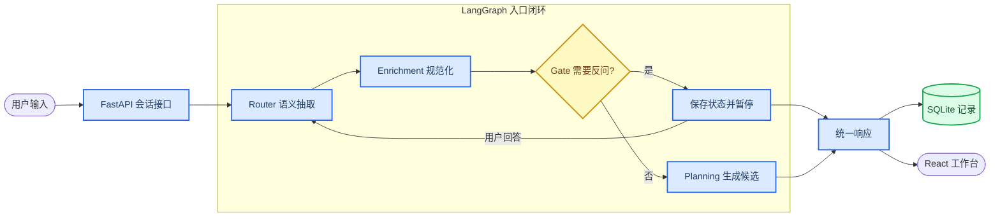

# M1 核心入口闭环学习复盘

_持续更新中的学习文档；代码已完成，学习尚未完成 · 最后更新：2026-08-14_

---

> **当前状态：** 已学习约束来源与 interrupt/resume，正在进入 Planning。本文中的面试表达仍是草稿，只有完成闭卷复述和实验后才算掌握。

## 🎯 M1 解决的问题

用户用一句自然语言描述周末需求后，系统需要形成可检查的约束；缺少非关键条件时透明默认，关键条件无法确定时只问必要问题；条件足够时生成结构化候选或明确冲突，并通过 HTTP、SQLite 和 React 形成可恢复的纵向闭环。

M1 明确不包含真实天气、真实 POI、真实路线、可编辑约束和真实订单执行。

## 🔄 端到端链路

### 代码入口

| 环节 | 主要文件 | 当前职责 |
| --- | --- | --- |
| 领域契约 | `app/domain/constraints.py`、`app/domain/planning.py` | 定义节点间强类型输入输出和不变量 |
| 语义入口 | `app/services/demo_router.py`、`router_extractor.py` | 离线规则或真实 LLM 生成同一种 `Interpretation` |
| 约束补全 | `app/services/enrichment.py` | 解析原始表达、补默认并保留来源 |
| 必要反问 | `app/services/question_gate.py` | 按确定性优先级决定 blocking question |
| Graph | `app/orchestration/entry_graph.py` | 路由、interrupt、checkpoint 和恢复 |
| 候选规划 | `app/services/planning.py` | 适配 V1 Planner，返回候选或结构化冲突 |
| HTTP 与持久化 | `app/api/application.py`、`app/persistence/` | 会话接口、消息、方案和 checkpoint |
| 前端 | `frontend/src/App.tsx` | 消费 question、plans、conflict 和约束摘要 |
| 评测 | `evals/`、`tests/` | 单元、集成与离线 smoke 验证 |

## 🧱 已学习的关键设计

### 约束来源不是同一层概念

| 来源 | 含义 | 示例 | 是否属于 Assumption |
| --- | --- | --- | --- |
| `user_explicit` | 用户直接明确表达 | “两个人”“人均 150” | 否 |
| `user_inferred` | 用户提供间接证据，系统作推断 | “约会”推断两人 | 否 |
| `default_rule` | 用户没有表达或暗示，系统使用产品默认 | 默认最近周末、默认距离 | 是 |
| `system_context` | 来自系统上下文 | 当前定位 | 否 |

`ConstraintValue` 保存规范化后的值和来源；`Assumption` 解释系统为什么补了默认值。用户推断虽然可能需要编辑，但不能伪装成系统默认。

### 用户没说与系统没懂必须区分

- 用户没说：非阻断字段可以使用透明默认并继续规划
- 用户说了但无法解析：保留缺失，交给 Gate 判断是否必须反问

如果把两者都直接默认，系统可能悄悄违背用户明确提出的要求。

### Gate 不由 LLM 自由决定

Router 只产出事实性的结构化解释；Gate 根据产品规则检查严格预算、显式但未解析的日期、地点、距离等字段。这样同一种输入的反问行为可重复、可单测，也能解释优先级。

### 回答恢复后重新经过 Router

用户的回答可能只是一个数字，也可能纠正时间、取消需求或开始新计划。Graph checkpoint 保存暂停状态；恢复时把原请求与补充回答组合，再经过 Router 和后续确定性节点，而不是假设回答一定等于某个字段值。

## 🧪 已完成的参与证据

| 证据 | 用户参与的判断 | 自动验证 |
| --- | --- | --- |
| `d12d5d7` | “约会”人数属于 `user_inferred`，不能进入 `Assumption`；“朋友”不能直接等于两人 | Router、Enrichment、API 与前端构建 |
| `b27817a` | 推断字段必须同时有值、证据和 confidence | Pydantic 跨字段失败测试与全量回归 |
| Gate 场景推演 | 严格预算缺金额必须反问 | `tests/test_question_gate.py` |
| interrupt/resume 复述 | 回答需要结合原请求重新抽取 | `tests/test_entry_graph.py`、`tests/test_api.py` |

## 🎤 当前面试表达草稿

### 30 秒版本

M1 把自然语言入口拆成 LLM 语义抽取和确定性业务决策两层。Router 只生成带证据的结构化解释，Enrichment 负责默认与来源，Gate 决定必要反问，LangGraph 管理 interrupt 和 checkpoint，Planner 返回候选或结构化冲突。这样模型负责模糊语言理解，规则负责可测试的业务约束。

### 深挖时要能回答

- 为什么不让 Router 顺便补齐默认值
- 为什么 confidence 不是可靠概率，只是推断元数据
- 为什么“和朋友出去”不能推断准确人数
- 为什么 Gate 是普通 Service，而不是另一个 Agent
- checkpoint 保存什么，SQLite 业务数据又保存什么
- 为什么恢复后重新抽取，而不是直接把回答写入待补字段

## 📖 相关基础知识

| 主题 | 与项目的连接 | 当前掌握 |
| --- | --- | --- |
| Pydantic 结构化输出 | 定义 Router 输出并拒绝不自洽元数据 | `L2` |
| `model_validator` | 检查推断值、证据和置信度的跨字段不变量 | `L2` |
| LangGraph State | 在节点间携带解释、约束、问题和候选 | `L2` |
| interrupt 与 checkpoint | 暂停并恢复有状态工作流 | `L2` |
| 确定性节点与 Agent | 根据决策自主性分配 LLM 和普通代码 | `L2` |
| Adapter | 用稳定 V2 接口包住仍在复用的 V1 Planner | 待学习 |
| 硬约束与评分 | 区分可行性和偏好排序 | 待学习 |
| API 状态机与持久化 | 区分新请求、恢复请求和业务记录 | 待学习 |

## ✅ M1 学习完成标准

- [ ] 不看代码画出完整请求和反问恢复链路
- [ ] 独立解释 Raw、Normalized、Assumption 和 provenance
- [ ] 修改一条 Enrichment 或 Gate 测试并预测结果
- [ ] 解释 Planner 的生成、评分、复检和冲突
- [ ] 从一个 HTTP 请求追踪到 checkpoint、消息和方案记录
- [ ] 解释前端如何处理 question、plans 和 conflict
- [ ] 说明离线 smoke 能证明什么、不能证明什么
- [ ] 完成一次 2 分钟项目讲解和至少三轮追问
- [ ] 按最终理解重写本页的面试讲解

## 📍 下一学习切片

Planning：理解 `NormalizedConstraints -> CandidateSet`，以及 V2/V1 适配、候选生成、评分排序、硬约束复检和结构化冲突之间的职责边界。
