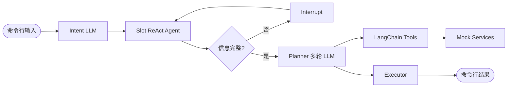
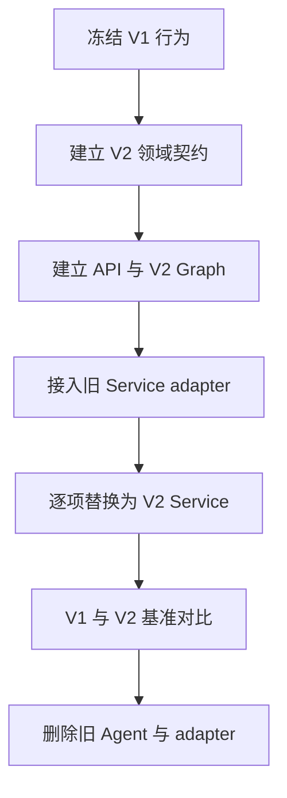

# HappyFreeTime V2 差距分析

> 基线日期：2026-08-12 | 当前代码：V1 实验链路 + 部分确定性 Service | 目标：`../canonical/architecture_v2.md` | 状态：冻结的历史快照，M1 已在该日期后实现

---

## 1. 结论

当前项目不是从零开始：Mock 目录、可行性校验、评分、候选方案、订单模拟和 RouterExtractor 都已有可复用雏形。真正缺失的是把这些能力收束成一条有契约、有持久化、有前端、有执行安全和可评测的产品链路。

建议不要继续修补旧四 Agent Graph。保留它作为 V1 对照，在新 `app/` 目录中建立 V2；通过适配器逐步复用 Service，完成一次对比后再移除旧链路。

## 2. 当前实现盘点

### 2.1 已有资产

| 资产 | 当前能力 | 复用判断 |
| --- | --- | --- |
| `Agents/graph.py` | Intent -> Slot -> Planner -> Executor，支持 interrupt | 仅保留为 V1 基线，控制流不直接扩展 |
| `RouterExtractor` | 一次 LLM 合并意图与原始约束抽取 | 思路可复用，输出和依赖需重写为 Pydantic 契约 |
| `catalog_service.py` | JSON 资源加载、半径过滤、活动/餐厅/商品搜索 | 可作为 V2 CatalogProvider/Service 原型 |
| `feasibility_service.py` | 营业、库存、路线、排队、天气适配 | 规则可复用，接口需统一 Provider 元数据 |
| `scoring_service.py` | 活动、餐厅、商品、方案规则评分 | 维度和解释可复用，需支持策略权重和硬约束分离 |
| `planning_service.py` | 活动 + 餐厅固定组合，safe/budget/rich 三方案 | 组合辅助函数可复用，主规划器需重构为通用多站模型 |
| `order_service.py` | 内存库存、订票、订座、商品、取消 | 仅作 Mock 逻辑参考，需持久化、幂等和状态机 |
| `Tools.py` | Service 的 LangChain tool 包装 | V2 首期不需要给 LLM 暴露，逐步改为 Provider/Service 调用 |
| `data/*.json` | 少量活动、餐厅、商品和测试场景 | 可作开发 fixture，正式数据需真实 POI 基础与来源字段 |
| `test/*` | 全链路和 Mock 层验证脚本 | 场景可迁移，测试框架和断言需要系统化 |

### 2.2 当前运行链路

该链路验证了 LangGraph、中断、工具封装和 Mock 业务的可行性，但不适合作为最终产品架构：LLM 调用次数高，状态和接口松散，规划与执行安全边界不够清晰。

## 3. 架构差距

### 3.1 P0 阻塞差距

| 领域 | 当前状态 | V2 目标 | 首个动作 |
| --- | --- | --- | --- |
| Graph 入口 | 旧 Intent/Slot 链仍生效 | Router -> Enrichment -> Gate | 新建 V2 graph，不在旧 graph 上继续叠加 |
| 结构化契约 | 大量 `dict` 和手工 JSON 解析 | 跨节点 Pydantic 模型 | 先定义 domain models 和错误类型 |
| Router | 未接入 Graph；注入位置和天气；解析失败可能转闲聊 | 只抽取，结构化输出，失败安全澄清 | 移除工具与业务默认注入，增加验证重试 |
| Enrichment | 尚无独立实现 | 确定性解析、Provider 补全、默认值和来源 | 建规则表与 provenance 模型 |
| Gate | 由 Slot LLM 的 `is_complete` 决定 | 动态 blocking 规则 | 建场景化必填矩阵和单问题策略 |
| 规划 | 固定活动 + 餐厅组合 | 通用 2-4 站、硬约束、真实路线复核 | 先统一 `Stop`、`RouteLeg`、`Plan` |
| API / UI | 只有命令行入口 | FastAPI + React + SSE | M1 建最小会话 API 和工作区 |
| 持久化 | MemorySaver 和进程内订单 | SQLite 业务库 + checkpointer | 建 schema、repository 和 migration |
| 执行安全 | Executor 可直接调 Mock 动作 | 预览、确认快照、幂等、Saga | 执行移到独立 Subgraph，LLM 不持写工具 |

### 3.2 P1 产品化差距

| 领域 | 当前状态 | 所需补齐 |
| --- | --- | --- |
| Provider | 天气 MCP 与本地估算散落在工具中 | 高德接口、统一结果、缓存、live/record/replay/mock |
| 数据 | 本地虚构数据，无完整来源治理 | 30-50 个北京真实 POI 基础字段和动态 Mock 状态 |
| 方案多样性 | 固定 safe/budget/rich | 动态策略、硬约束全通过、相似度控制 |
| 修改体验 | 通过 `refine_plan` 重新让 Planner 生成 | ConstraintPatch、锁定、局部替换、差异展示 |
| 订单 | 内存字典，进程重启丢失 | orders + append-only order_events + 取消与补偿 |
| 身份隔离 | 固定 `thread_id="1"` | ActorContext、user_id、session_id 和资源归属过滤 |
| 前端交互 | 文本打印 | 三栏工作区、地图、时间线、订单和方案对比 |
| 可观测性 | 控制台耗时打印 | run trace、阶段事件、Provider/LLM/规则版本和脱敏 |
| 评测 | 脚本和场景数据 | EvalCase、invariant、回放、报告和 V1/V2 对比 |

### 3.3 P2 增强差距

- Beam Search：数据和停靠点规模扩大后再实现。
- 长期记忆与身份合并：在匿名多会话稳定后加入。
- 轻量只读 MCP：在 Service 接口稳定后增加。
- 轻量注册登录、在线部署和公开 Demo。
- 更完整的评测面板、故障注入和跨模型对比。

## 4. 关键代码问题

### 4.1 状态契约易漂移

旧 Graph、Intent、Slot、Planner 和 Executor 通过自由字典共享状态。字段存在 `intent`/`primary`、`slot`/`constraints`、`items`/`timeline` 等多套语义，编译期无法发现不兼容。

处理方式：V2 不增加兼容字段，而是先建立 Pydantic 领域模型；V1 数据只能通过单向 adapter 进入 V2，禁止 V2 反向依赖 V1 字典。

### 4.2 LLM 职责过宽

Slot Agent 既调用当前时间、位置、天气，又抽取信息和判断完整性；Planner 通过多轮模型调用自行选择工具和组织结果；Executor 还使用名称匹配推断资源。延迟、失败面和不可重复性都被放大。

处理方式：只保留 Router 的必要 LLM 和 Presenter 的可选 LLM。资源 ID、路线、排序、执行动作全部由代码和领域事实决定。

### 4.3 RouterExtractor 与已确认设计不一致

当前 RouterExtractor 已实现“一次 LLM”，但仍提前收集默认位置和天气并注入 Prompt；输出依赖手工截取 JSON，修复时还会再次调用 LLM；最终失败会回退为 `chitchat`。

处理方式：保留 Prompt 中的抽取规则和证据思想，改为 Pydantic structured output；只允许注入当前日期和时区语境；失败进入显式解析错误或澄清路径。

### 4.4 规划器只覆盖双站固定模板

当前 `planning_service` 对活动和餐厅排序后构建 safe/budget/rich 三种固定组合，无法自然表达一日 4 站、用户必选停靠点、锁定、局部替换和基于真实路线的重排。

处理方式：把资源统一为 `StopCandidate`，把组合器改为 itinerary policy + 有界搜索。现有时间工具、路线估算、评分原因和时间线校验可以拆出复用。

### 4.5 Mock 订单不是业务状态机

当前订单、库存和确认号保存在进程内字典中，缺少用户隔离、幂等键、确认快照、部分成功、补偿和审计事件。

处理方式：不要直接把内存字典换成数据库就结束；先定义 Order/OrderEvent/ExecutionAction 状态机，再实现 repository 和 Saga。

### 4.6 基础工程尚未形成应用

当前依赖只有 LangGraph、LangChain、OpenAI 兼容客户端和 dotenv。尚无 FastAPI、Pydantic Settings、SQLAlchemy/Alembic、正式测试配置、前端工程、日志与迁移系统。

处理方式：M1 先建立最小应用骨架和一条纵向链路，避免先搭完整平台再验证规划价值。

## 5. 复用与替换矩阵

| 当前模块 | 策略 | V2 去向 |
| --- | --- | --- |
| `IntentAgent` | 冻结后删除 | 合并进 RouterExtractor |
| `SlotAgent` | 冻结后删除 | Enrichment + NeedQuestion Gate |
| `PlannerAgent` | 冻结后删除 | PlanningSubgraph + Presenter |
| `ExecutorAgent` | 只参考行为 | ExecutionPolicy + ExecutionSubgraph |
| `Tools.py` | 拆分 | Provider adapter、Service API、后期 MCP adapter |
| `catalog_service` | 重构复用 | CatalogService / MockCatalogProvider |
| `feasibility_service` | 重构复用 | FeasibilityService + local fallback |
| `scoring_service` | 重构复用 | StrategyScorer + ConstraintVerifier |
| `planning_service` | 部分复用 | CandidateBuilder / TimelineBuilder |
| `order_service` | 规则参考 | MockBookingProvider + OrderService |
| `data/*.json` | 作为 fixture 保留 | `data/fixtures`，另建 curated POI 数据 |
| `test_cases.json` | 迁移语义 | `evals/cases` 的初始 smoke cases |

## 6. 推荐迁移策略

### 6.1 迁移约束

- 不修改或回滚用户现有的无关改动。
- 新链路只写入 `app/` 和 `frontend/`，旧目录原则上只修阻塞性 bug。
- 用 `graph_version=v1|v2` 保留短期切换能力。
- 每迁移一个 Service，先写契约测试，再替换 adapter。
- V2 达到 M2 且完成一次对比前，不删除 V1。
- 不建立双向同步或长期双写，adapter 是一次性迁移工具。

## 7. 风险清单

| 风险 | 可能后果 | 控制措施 |
| --- | --- | --- |
| 过早做全功能前端 | 核心规划仍不稳定 | M1 只做最小工作区，M2 后扩交互 |
| 真实路线调用过多 | 延迟与配额失控 | 本地剪枝，只验证 finalist 路段 |
| 默认值过度替用户决定 | 结果看似完整但不可信 | provenance、Assumption、Gate 动态规则 |
| 多站组合爆炸 | 响应变慢 | 有界候选、策略骨架、局部搜索，Beam Search 后置 |
| Mock 数据伪装真实 | 产品可信度受损 | 基础 POI 与动态业务数据分源展示 |
| Graph 节点过碎 | 调试和状态复杂度上升 | 只为业务阶段、分支和恢复建节点 |
| 评测后置 | 最终没有可信量化结果 | M1 建 smoke eval 与 trace schema |
| 执行恢复重复下单 | 业务正确性失败 | 业务事务优先、幂等键、订单事实源 |

## 8. 进入开发前的完成标准

以下内容在开始 M1 代码前应被视为已确定：

- `architecture_v2.md` 作为唯一架构基线。
- V1 冻结，V2 新目录开发。
- Pydantic 核心模型名称、标识符和字段来源枚举。
- M1 的输入场景、输出结构和 smoke eval cases。
- 北京 Demo 默认区域和第一批真实 POI 清单。
- 高德 Key 缺失时的本地降级行为。

其余评分权重、UI 视觉细节和完整评测集允许在后续里程碑中依据实际结果调整。
